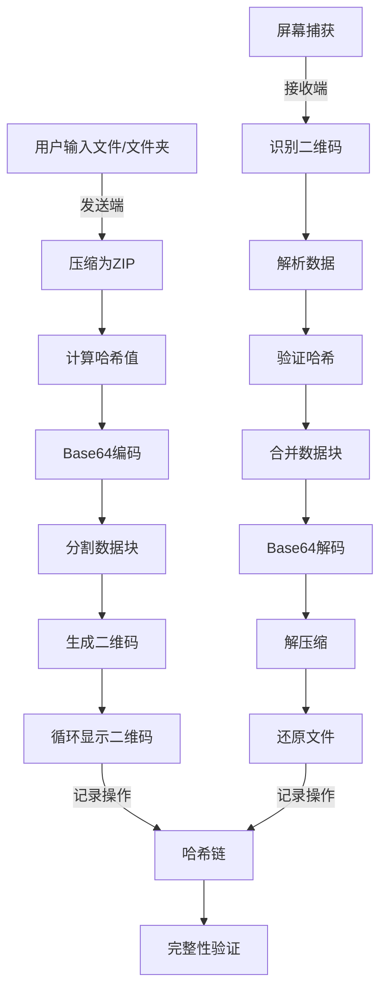

欢迎使用QR Code文件传输工具！这是一个基于Python开发的创新文件传输解决方案，通过二维码技术实现文件或文件夹的安全传输。本项目提供了完整的Python源码和独立可执行文件两种使用方式，适合各种场景下的文件传输需求。

## 项目简介

QR Code文件传输工具是一个轻量级但功能强大的文件传输解决方案，它利用二维码作为数据载体，实现了无需网络连接的文件传输。该工具支持文件压缩、Base64编码、数据分块、二维码生成与读取等完整流程，并集成了基于哈希链的区块链可追溯功能，确保传输过程的安全性和可验证性。

Sources: [README.md](README.md#L1-L10)

## 核心功能

### 二维码生成（发送端）
- 将文件或文件夹压缩为ZIP格式
- 转换为Base64编码
- 生成包含元数据的二维码（任务ID、总个数、当前索引、数据块、哈希值）
- 按设定时间循环显示二维码

### 二维码读取（接收端）
- 从屏幕捕获二维码
- 自动识别多个二维码
- 校验数据完整性
- 还原为原始文件或文件夹

### 区块链可追溯
- 基于哈希链的操作记录
- 每个操作生成哈希块
- 支持链完整性验证
- 确保操作可追溯、不可篡改

Sources: [README.md](README.md#L23-L65)

## 系统架构



Sources: [README.md](README.md#L127-L163), [main.py](main.py#L1-L333)

## 项目结构

```
qrcode_transfer/
├── main.py              # 主程序入口（完整功能）
├── send.py              # 发送端入口（轻量版）
├── receive.py           # 接收端入口（完整版）
├── config.ini           # 配置文件
├── requirements.txt     # 依赖库列表
├── build.bat            # 一键打包脚本
├── dist/                # 打包后的可执行文件
│   ├── qr-send.exe      # 发送端（~23MB）
│   └── qr-receive.exe   # 接收端（~81MB）
└── modules/             # 功能模块
    ├── config_manager.py # 配置管理
    ├── config_init.py    # 配置初始化
    ├── logger.py         # 日志管理
    ├── compressor.py     # 压缩解压缩
    ├── encoder.py        # base64编码解码
    ├── qrcode_generator.py # 二维码生成
    ├── displayer.py      # 二维码显示
    ├── qrcode_reader.py  # 二维码识别
    ├── validator.py      # 数据校验
    └── blockchain.py     # 哈希链管理
```

Sources: [README.md](README.md#L230-L257)

## 技术栈

| 技术/库 | 用途 | 使用端 |
|---------|------|--------|
| Python 3.8+ | 开发语言 | 两端 |
| qrcode[pil] | 二维码生成 | 发送端 |
| pillow | 图像处理 | 两端 |
| pyzbar | 二维码识别 | 接收端 |
| opencv-python | 图像处理 | 接收端 |
| pyautogui | 屏幕捕获 | 接收端 |
| pycryptodome | 哈希计算 | 两端 |
| tkinter | GUI 显示 | 发送端 |
| numpy | 数组处理 | 接收端 |

Sources: [README.md](README.md#L259-L274)

## 应用场景

本工具适用于以下场景：
- 无网络环境下的文件传输
- 需要物理隔离的安全环境
- 跨设备临时文件共享
- 教学演示与技术展示
- 区块链可追溯性需求场景

## 下一步

想要开始使用QR Code文件传输工具？请继续阅读：
- [快速开始](2-kuai-su-ru-men) - 了解如何快速上手使用本工具
- [环境配置](3-huan-jing-pei-zhi) - 学习如何配置开发环境
- [安装依赖](4-an-zhuang-yi-lai) - 了解项目依赖的安装方法