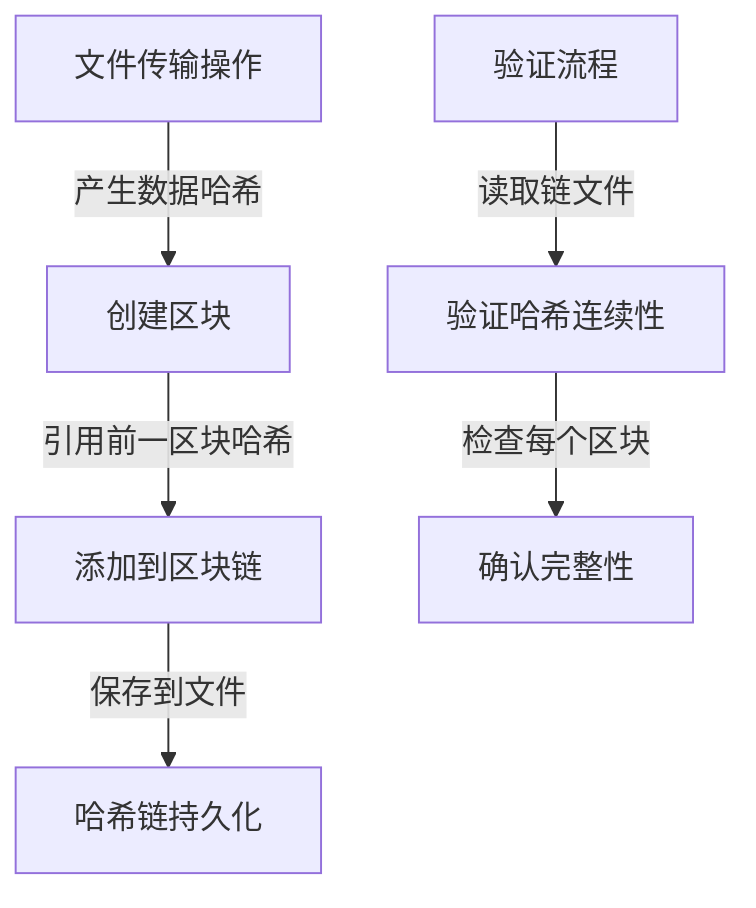
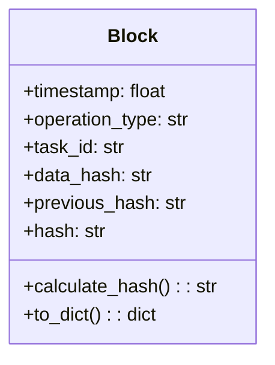

本页面详细介绍了二维码文件传输程序中的区块链功能配置，帮助您了解如何启用和配置哈希链可追溯性功能，确保数据传输的完整性和可追溯性。

## 区块链功能概述

程序采用简化的区块链（哈希链）机制来记录文件传输过程中的关键操作，通过不可逆的哈希算法确保每一步操作都可被验证和追溯。区块链功能在整个系统中的作用如下：



区块链模块作为核心数据完整性保障组件，与配置管理、验证器等模块紧密协作，共同构建可信的数据传输环境。

Sources: [modules/blockchain.py](modules/blockchain.py#L1-L235)

## 配置项详解

区块链配置位于 `config.ini` 文件的 `[Blockchain]` 节，包含以下关键配置项：

| 配置项 | 类型 | 默认值 | 说明 | 可选值 |
|--------|------|--------|------|--------|
| Enabled | 布尔值 | True | 是否启用哈希链可追溯功能 | True, False |
| HashAlgorithm | 字符串 | SHA256 | 用于计算区块哈希的算法 | SHA256, SHA512, MD5 |
| ChainFile | 字符串 | hash_chain.json | 哈希链数据存储文件路径 | 任意有效文件路径 |

### Enabled（启用开关）

控制整个区块链功能的启用与禁用。当设置为 `False` 时，程序将跳过所有区块链相关操作，包括区块创建、链验证等。

```ini
[Blockchain]
Enabled = True
```

在 `Blockchain` 类初始化时，会读取此配置项决定是否加载和保存哈希链：

```python
self.is_enabled = config_manager.getboolean('Blockchain', 'Enabled', True)
```

Sources: [config.ini](config.ini#L40-L47), [modules/blockchain.py](modules/blockchain.py#L67-L70)

### HashAlgorithm（哈希算法）

指定用于计算区块哈希的加密算法，支持三种常用哈希算法。哈希算法的选择会影响区块的安全性和计算性能：

```ini
[Blockchain]
HashAlgorithm = SHA256
```

各算法特点对比：

| 算法 | 输出长度 | 安全性 | 计算速度 | 适用场景 |
|------|----------|--------|----------|----------|
| MD5 | 128位 | 低 | 快 | 非安全场景的快速校验 |
| SHA256 | 256位 | 高 | 中 | 通用安全场景 |
| SHA512 | 512位 | 极高 | 较慢 | 高安全性要求场景 |

验证器模块会根据此配置选择对应的哈希算法实现：

```python
if self.hash_algorithm == 'SHA256':
    hash_obj = SHA256.new(data)
elif self.hash_algorithm == 'SHA512':
    hash_obj = SHA512.new(data)
elif self.hash_algorithm == 'MD5':
    hash_obj = MD5.new(data)
```

Sources: [config.ini](config.ini#L40-L47), [modules/validator.py](modules/validator.py#L32-L43)

### ChainFile（链文件路径）

指定哈希链数据的持久化存储文件路径。程序会将所有区块信息以 JSON 格式保存到此文件中：

```ini
[Blockchain]
ChainFile = hash_chain.json
```

区块链模块在初始化时会加载此文件，并在添加新区块后自动保存：

```python
self.chain_file = config_manager.get('Blockchain', 'ChainFile', 'hash_chain.json')
# ...
def _save_chain(self):
    """保存哈希链到文件"""
    if not self.is_enabled:
        return
    # ... 保存逻辑
```

Sources: [config.ini](config.ini#L40-L47), [modules/blockchain.py](modules/blockchain.py#L66-L67), [modules/blockchain.py#L93-L106)

## 区块结构与哈希计算

每个区块包含以下关键字段，这些字段共同参与哈希计算，确保区块内容不可篡改：



区块的哈希值通过以下方式计算：

```python
def calculate_hash(self):
    """计算块的哈希值"""
    block_string = json.dumps({
        'timestamp': self.timestamp,
        'operation_type': self.operation_type,
        'task_id': self.task_id,
        'data_hash': self.data_hash,
        'previous_hash': self.previous_hash
    }, sort_keys=True)
    return validator.calculate_hash(block_string)
```

通过对关键数据进行 JSON 序列化并按键排序后计算哈希，确保了相同内容总是产生相同的哈希值，同时也保证了区块内容的任何修改都会导致哈希值变化。

Sources: [modules/blockchain.py](modules/blockchain.py#L11-L30)

## 配置建议

根据不同使用场景，我们提供以下配置建议：

### 高安全性场景

对于需要高度数据完整性保障的场景，建议使用以下配置：

```ini
[Blockchain]
Enabled = True
HashAlgorithm = SHA512
ChainFile = hash_chain.json
```

### 平衡性能与安全场景

对于大多数常规使用场景，推荐使用默认配置，在安全性和性能之间取得良好平衡：

```ini
[Blockchain]
Enabled = True
HashAlgorithm = SHA256
ChainFile = hash_chain.json
```

### 测试或快速原型场景

在测试环境或快速原型开发中，可以根据需要调整配置：

```ini
[Blockchain]
Enabled = True
HashAlgorithm = MD5
ChainFile = test_chain.json
```

## 相关页面

要了解区块链功能的详细实现原理，请参考 [区块链实现](17-qu-kuai-lian-shi-xian) 页面。

要学习如何验证区块链完整性，请查看 [验证区块链完整性](7-yan-zheng-qu-kuai-lian-wan-zheng-xing) 页面。

要了解其他配置项，请参阅 [配置文件概述](8-pei-zhi-wen-jian-gai-shu) 及相关配置页面。