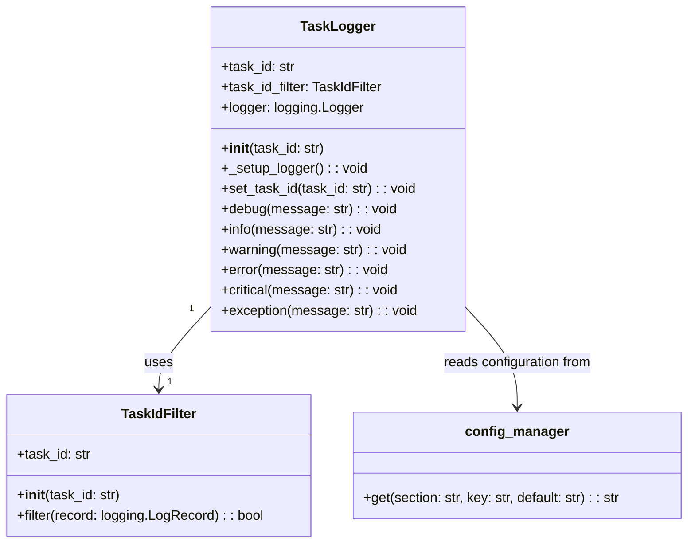
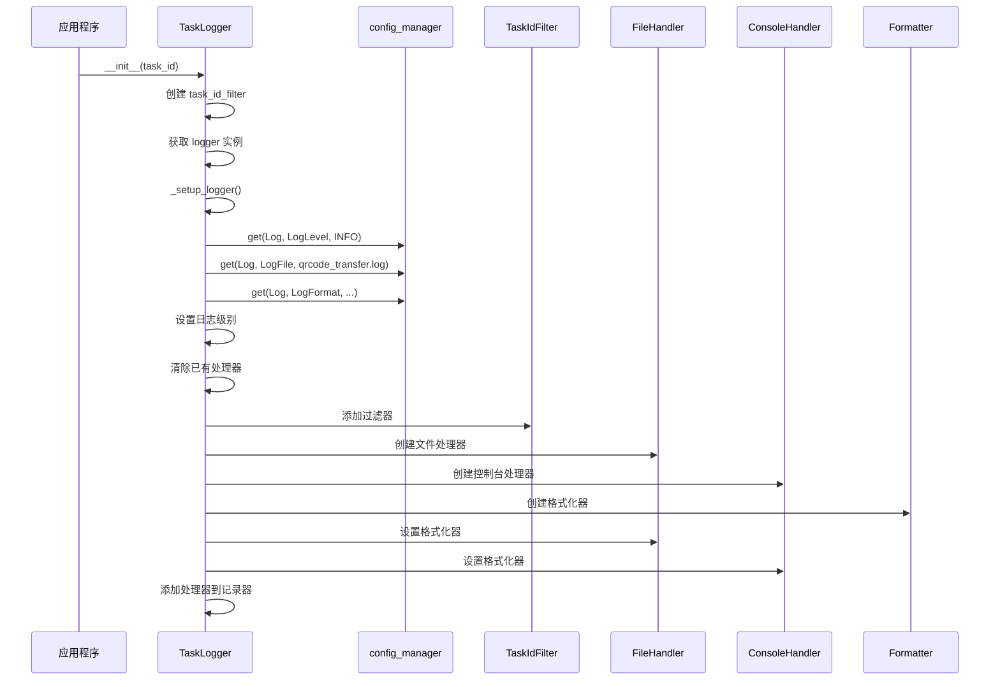

本页面详细介绍二维码文件传输程序的日志系统配置，帮助开发者了解如何配置和使用日志功能，以便更好地监控程序运行状态和排查问题。

## 日志系统概述

程序使用 Python 标准库 `logging` 实现日志功能，通过 `modules/logger.py` 中的 `TaskLogger` 类进行管理。日志系统同时将信息输出到文件和控制台，方便实时查看和后续分析。



日志系统特点：
- 支持多级别日志记录
- 可自定义日志输出格式
- 支持任务ID追踪，便于区分不同传输任务
- 同时输出到文件和控制台

Sources: [logger.py](modules/logger.py#L1-L85)

## 配置项说明

日志配置集中在 `config.ini` 文件的 `[Log]` 部分，包含以下三个核心配置项：

| 配置项 | 说明 | 默认值 | 可选值 |
|--------|------|--------|--------|
| LogLevel | 日志记录级别 | INFO | DEBUG, INFO, WARNING, ERROR, CRITICAL |
| LogFile | 日志文件路径 | qrcode_transfer.log | 任意有效的文件路径 |
| LogFormat | 日志输出格式 | %(asctime)s - %(levelname)s - %(task_id)s - %(message)s | 符合logging模块格式规范的字符串 |

Sources: [config.ini](config.ini#L36-L42)

## 日志系统架构与初始化流程

日志系统通过 `TaskLogger` 类初始化，其内部工作流程如下：



在 `_setup_logger()` 方法中，日志系统首先从配置文件中读取设置，然后创建两个处理器（文件和控制台），并为它们应用相同的格式化器，确保一致的日志输出格式。

Sources: [logger.py](modules/logger.py#L14-L40)

## 日志级别详解

日志级别从低到高依次为：


| 级别 | 用途 | 适用场景 |
|------|------|----------|
| DEBUG | 详细调试信息 | 开发阶段，需要追踪程序内部运行细节 |
| INFO | 一般信息 | 日常使用，记录程序关键流程 |
| WARNING | 警告信息 | 提示潜在问题，但程序仍能继续运行 |
| ERROR | 错误信息 | 记录错误发生，但程序仍能继续运行 |
| CRITICAL | 严重错误 | 记录严重错误，可能导致程序终止 |

设置较高的日志级别会自动包含所有更低级别的日志。例如，设置为 `INFO` 级别会同时记录 `INFO`、`WARNING`、`ERROR` 和 `CRITICAL` 级别的日志。

Sources: [logger.py](modules/logger.py#L16-L17)

## 任务ID追踪机制

日志系统的一个特色功能是支持任务ID追踪，这通过 `TaskIdFilter` 类实现：

```python
class TaskIdFilter(logging.Filter):
    """日志过滤器，用于注入 task_id 字段"""
    def __init__(self, task_id="unknown"):
        super().__init__()
        self.task_id = task_id

    def filter(self, record):
        record.task_id = self.task_id
        return True
```

该过滤器在每条日志记录中注入 `task_id` 字段，使得在处理多个并发任务时能够区分和追踪每个任务的日志。`TaskLogger` 类还提供了 `set_task_id()` 方法，可以在运行时动态更改任务ID。

Sources: [logger.py](modules/logger.py#L5-L12)

## 日志格式自定义

`LogFormat` 配置项允许自定义日志输出格式，常用格式占位符包括：

| 占位符 | 说明 |
|--------|------|
| %(asctime)s | 日志记录时间 |
| %(levelname)s | 日志级别名称 |
| %(task_id)s | 任务ID（程序自定义字段） |
| %(message)s | 日志消息内容 |
| %(filename)s | 调用日志的文件名 |
| %(lineno)d | 调用日志的行号 |
| %(funcName)s | 调用日志的函数名 |

默认格式 `%(asctime)s - %(levelname)s - %(task_id)s - %(message)s` 会生成类似以下的日志条目：
```
2023-05-15 14:30:45,123 - INFO - TASK-12345678 - 开始处理文件
```

Sources: [config.ini](config.ini#L41)

## 日志使用示例

`TaskLogger` 类提供了以下方法用于记录不同级别的日志：

| 方法 | 对应级别 | 示例 |
|------|----------|------|
| debug() | DEBUG | `logger.debug("变量值: %s", variable)` |
| info() | INFO | `logger.info("任务开始执行")` |
| warning() | WARNING | `logger.warning("空间不足，请注意")` |
| error() | ERROR | `logger.error("读取文件失败")` |
| critical() | CRITICAL | `logger.critical("系统错误，无法继续")` |
| exception() | ERROR | `logger.exception("发生异常")` |

其中 `exception()` 方法特别适合在 except 块中使用，它会自动记录堆栈跟踪信息。

Sources: [logger.py](modules/logger.py#L42-L83)

## 全局日志实例

为了方便使用，日志模块在加载时创建了一个全局的日志实例：

```python
# 创建全局日志实例
logger = TaskLogger()
```

这样，其他模块可以直接导入并使用这个全局实例：

```python
from modules.logger import logger

logger.info("这是一条信息日志")
```

如果需要自定义任务ID，可以通过两种方式实现：
1. 使用默认实例并调用 `set_task_id()` 方法
2. 创建新的 `TaskLogger` 实例，传入自定义任务ID

Sources: [logger.py](modules/logger.py#L85)

## 下一步

了解了日志配置后，您可以继续阅读：
- [配置文件概述](8-pei-zhi-wen-jian-gai-shu) - 了解整体配置结构
- [常见问题](20-chang-jian-wen-ti) - 查看日志相关的常见问题解答
- [故障排除](21-gu-zhang-pai-chu) - 学习如何利用日志进行故障排查