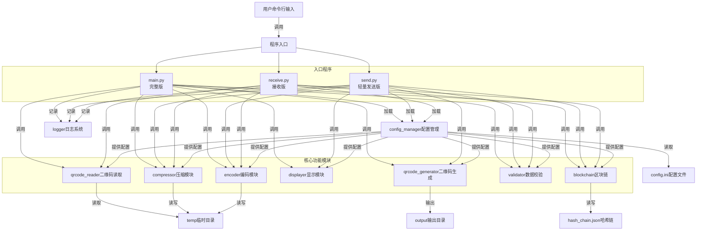
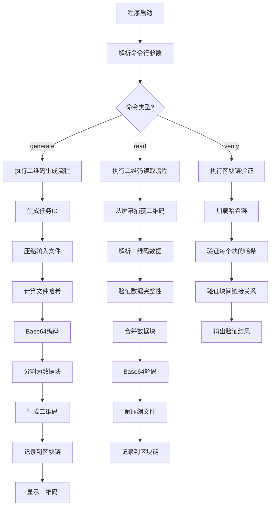

本页面概述QR Code文件传输工具的整体系统架构，包括核心模块组成、数据流关系和主要功能特性。通过本文档，读者将对系统的设计思路和实现方式有全面的理解。

## 系统整体架构

QR Code文件传输工具采用模块化设计，通过清晰的职责划分实现功能解耦。系统以主程序为中心，各功能模块通过统一的配置管理器和日志系统进行协调。



系统架构设计遵循单一职责原则，每个模块负责特定功能，通过主程序协调工作流程。配置管理器提供全局配置服务，日志系统统一记录操作信息。系统提供三个独立的入口程序以适应不同使用场景：
- `main.py`：完整版，包含发送和接收全部功能
- `send.py`：轻量发送版，仅包含二维码生成功能，排除了cv2、numpy等重量级依赖
- `receive.py`：接收版，包含二维码读取和文件还原功能

Sources: [main.py](main.py#L1-L333), [send.py](send.py#L1-L156), [receive.py](receive.py#L1-L124), [modules/config_manager.py](modules/config_manager.py#L1-L83)

## 目录结构设计

项目采用清晰的目录结构，将核心功能代码、配置文件、输出文件等分离存放，便于维护和扩展。

```
qrcode_transfer/
├── main.py                    # 主程序入口（完整版）
├── send.py                    # 轻量发送程序入口
├── receive.py                 # 接收程序入口
├── config.ini                 # 配置文件
├── requirements.txt           # 依赖库列表
├── build.bat                  # Windows打包脚本
├── build_wiki.bat             # 文档构建脚本
├── README.md                  # 项目说明文档
├── qrcode_transfer.log        # 日志文件（运行时生成）
├── hash_chain.json            # 哈希链文件（运行时生成）
├── output/                    # 输出目录（存放生成的二维码）
├── temp/                      # 临时文件目录
├── dist/                      # 打包输出目录
│   ├── qr-send.exe            # 打包后的发送工具
│   └── qr-receive.exe         # 打包后的接收工具
├── docs/                      # 文档源文件
├── docs-site/                 # 构建后的文档网站
└── modules/                   # 功能模块目录
    ├── config_init.py         # 配置初始化模块
    ├── config_manager.py      # 配置管理模块
    ├── logger.py              # 日志管理模块
    ├── compressor.py          # 压缩/解压缩模块
    ├── encoder.py             # Base64编码/解码模块
    ├── qrcode_generator.py    # 二维码生成模块
    ├── displayer.py           # 二维码显示模块
    ├── qrcode_reader.py       # 二维码识别模块
    ├── validator.py           # 数据校验模块
    └── blockchain.py          # 哈希链管理模块
```

这种目录结构设计遵循了关注点分离原则，将可执行代码、配置、数据输出和临时文件明确分开，便于管理和部署。

Sources: [README.md](README.md#L1-L218), [build.bat](build.bat#L1-L61)

## 核心模块职责

系统由11个核心模块组成，每个模块负责特定功能，协同工作完成文件传输任务。

| 模块名称 | 主要职责 | 关键类/函数 |
|---------|---------|-----------|
| config_init | 初始化配置文件，确保首次运行时生成默认配置 | `ensure_config_exists()` |
| config_manager | 统一管理系统配置，提供配置项读取和保存功能 | `ConfigManager`类 |
| logger | 提供统一的日志记录服务，支持多级别日志和任务ID关联 | - |
| compressor | 负责文件和文件夹的压缩与解压缩 | - |
| encoder | 处理文件的Base64编码解码，以及数据块分割与合并 | - |
| qrcode_generator | 生成包含元数据的二维码，支持二维码数据解析 | `QRCodeGenerator`类 |
| displayer | 按设定时间间隔循环显示二维码 | - |
| qrcode_reader | 从屏幕捕获并识别二维码 | - |
| validator | 计算和验证哈希值，确保数据完整性 | `Validator`类 |
| blockchain | 管理哈希链，实现操作可追溯和完整性验证 | `Block`类, `Blockchain`类 |

每个模块都被设计为高内聚低耦合，通过明确的接口进行交互，便于单独测试和维护。

Sources: [modules/config_manager.py](modules/config_manager.py#L1-L83), [modules/blockchain.py](modules/blockchain.py#L1-L249), [modules/qrcode_generator.py](modules/qrcode_generator.py#L1-L144)

## 主程序工作流程

主程序是系统的协调中心，负责解析用户命令并调用相应模块完成任务。主要支持三种操作模式：生成二维码、读取二维码和验证区块链。



主程序采用命令行模式，通过argparse解析用户输入的命令和参数，然后根据命令类型调用相应的功能模块。整个工作流程清晰可见，便于理解和调试。

Sources: [main.py](main.py#L1-L333), [send.py](send.py#L1-L156), [receive.py](receive.py#L1-L124)

## 数据完整性保障机制

系统采用多层机制确保数据在传输过程中的完整性和可追溯性。

| 保障机制 | 实现方式 | 负责模块 |
|---------|---------|---------|
| 数据块哈希 | 每个二维码数据块附带独立哈希值 | validator, qrcode_generator |
| 文件哈希 | 压缩文件和Base64数据都有整体哈希 | validator |
| 操作记录 | 所有关键操作都记录到哈希链 | blockchain |
| 链完整性 | 区块链技术确保操作记录不可篡改 | blockchain |

这种多层次的完整性保障机制，从数据块到整个文件，从单次操作到完整流程，都提供了可靠的验证手段，确保数据传输的安全性。

Sources: [modules/validator.py](modules/validator.py), [modules/blockchain.py](modules/blockchain.py#L1-L249), [modules/qrcode_generator.py](modules/qrcode_generator.py#L1-L144)

## 下一步阅读

对系统架构有了整体了解后，建议按以下顺序深入阅读：

1. [模块介绍](14-mo-kuai-jie-shao) - 详细了解每个核心模块的功能和接口
2. [二维码生成流程](15-er-wei-ma-sheng-cheng-liu-cheng) - 深入理解文件到二维码的转换过程
3. [二维码读取流程](16-er-wei-ma-du-qu-liu-cheng) - 了解从二维码还原文件的完整流程
4. [区块链实现](17-qu-kuai-lian-shi-xian) - 探索哈希链的技术实现细节

通过以上文档的阅读，您将对系统有更全面深入的理解。