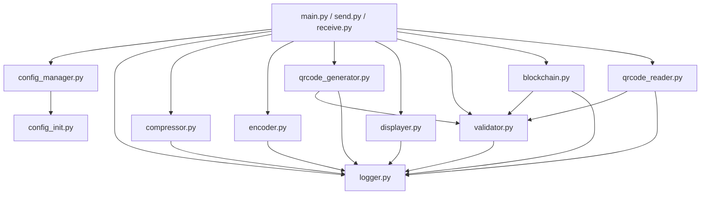

本页面详细介绍 qrcode_transfer 项目中的各个模块，包括其功能、核心类/函数及与其他模块的交互方式。通过本页面，您将了解项目的模块化架构及各组件的职责。

## 模块依赖关系

以下是项目模块间的主要依赖关系图，展示了数据流向和模块交互：

## 核心模块详解

### config_manager.py - 配置管理模块
负责加载、读取和保存配置文件，提供统一的配置访问接口。

**核心类**：
- `ConfigManager`: 配置管理器类，封装了 configparser 的功能
  - `get(section, option, fallback, cast_type)`: 获取配置项值
  - `getint/getfloat/getboolean()`: 获取特定类型的配置项
  - `set(section, option, value)`: 设置配置项值
  - `save()`: 保存配置到文件

**全局实例**：
- `config_manager`: 全局配置管理器实例，支持打包后环境自动查找配置文件

Sources: [modules/config_manager.py](modules/config_manager.py#L1-L83)

### config_init.py - 配置初始化模块
确保配置文件存在，若不存在则自动生成默认配置。

**核心函数**：
- `ensure_config_exists()`: 检查并生成默认配置文件

Sources: [modules/config_init.py](modules/config_init.py#L1-L86)

### logger.py - 日志管理模块
提供任务级别的日志记录功能，支持任务ID注入和多渠道日志输出。

**核心类**：
- `TaskIdFilter`: 日志过滤器，用于在日志中注入 task_id 字段
- `TaskLogger`: 任务日志记录器
  - `set_task_id(task_id)`: 设置当前任务ID
  - `debug/info/warning/error/critical/exception()`: 各级别日志记录方法

**全局实例**：
- `logger`: 全局日志记录器实例

Sources: [modules/logger.py](modules/logger.py#L1-L85)

### compressor.py - 压缩模块
负责文件和文件夹的压缩与解压缩操作。

**核心类**：
- `Compressor`: 压缩器类
  - `compress(input_path, output_path)`: 压缩文件或文件夹为 zip 格式
  - `decompress(zip_path, output_dir)`: 解压缩 zip 文件

**全局实例**：
- `compressor`: 全局压缩器实例

Sources: [modules/compressor.py](modules/compressor.py#L1-L97)

### encoder.py - 编码模块
负责数据的 base64 编解码以及数据块的分割与合并。

**核心类**：
- `Encoder`: 编码器类
  - `encode_file(file_path)`: 将文件编码为 base64 字符串
  - `decode_to_file(base64_str, output_path)`: 将 base64 字符串解码为文件
  - `split_into_blocks(base64_str, block_size)`: 将 base64 字符串分割为数据块
  - `merge_blocks(blocks)`: 合并数据块为完整的 base64 字符串

**全局实例**：
- `encoder`: 全局编码器实例

Sources: [modules/encoder.py](modules/encoder.py#L1-L154)

### qrcode_generator.py - 二维码生成模块
负责生成包含元数据的二维码图片。

**核心类**：
- `QRCodeGenerator`: 二维码生成器类
  - `generate_qr_code(task_id, total_blocks, current_block, data_block, output_path)`: 生成单个二维码
  - `generate_qr_codes(task_id, data_blocks, output_dir)`: 批量生成二维码
  - `parse_qr_data(qr_json)`: 解析二维码中的 JSON 数据

**全局实例**：
- `qr_generator`: 全局二维码生成器实例

Sources: [modules/qrcode_generator.py](modules/qrcode_generator.py#L1-L145)

### displayer.py - 显示模块
负责在屏幕上显示二维码图片，支持单个显示和循环轮播。

**核心类**：
- `Displayer`: 显示器类
  - `show_single_qr(qr_path)`: 显示单个二维码
  - `show_multiple_qr(qr_paths, task_id, total_size)`: 循环显示多个二维码

**全局实例**：
- `displayer`: 全局显示器实例

Sources: [modules/displayer.py](modules/displayer.py#L1-L167)

### validator.py - 验证模块
负责数据哈希计算和完整性验证。

**核心类**：
- `Validator`: 验证器类
  - `calculate_hash(data)`: 计算数据的哈希值
  - `verify_hash(data, expected_hash)`: 验证数据哈希值
  - `calculate_file_hash(file_path)`: 计算文件的哈希值
  - `verify_file_hash(file_path, expected_hash)`: 验证文件哈希值
  - `parse_qr_data(qr_json)`: 解析并验证二维码数据

**全局实例**：
- `validator`: 全局验证器实例

Sources: [modules/validator.py](modules/validator.py#L1-L155)

### blockchain.py - 区块链模块
实现哈希链功能，用于记录操作历史和验证数据完整性。

**核心类**：
- `Block`: 区块类，封装单个区块的数据和哈希计算
  - `calculate_hash()`: 计算区块哈希值
  - `to_dict()`: 转换为字典格式
  - `from_dict(block_dict)`: 从字典创建区块
- `Blockchain`: 区块链类，管理整个哈希链
  - `add_block(operation_type, task_id, data_hash)`: 添加新的区块
  - `is_chain_valid()`: 验证区块链完整性

**全局实例**：
- `blockchain`: 全局区块链实例

Sources: [modules/blockchain.py](modules/blockchain.py#L1-L249)

### qrcode_reader.py - 二维码读取模块
负责从屏幕或图像文件中读取并解析二维码数据。

**核心类**：
- `QRCodeReader`: 二维码读取器类
  - `capture_screen()`: 捕获屏幕图像
  - `read_qr_code(image)`: 从图像中识别二维码
  - `read_qr_from_screen()`: 从屏幕中识别二维码
  - `read_qr_from_file(file_path)`: 从文件中识别二维码
  - `read_all_qr_codes(max_attempts, interval)`: 持续读取并收集完整数据块

**全局实例**：
- `qr_reader`: 全局二维码读取器实例

Sources: [modules/qrcode_reader.py](modules/qrcode_reader.py#L1-L196)

## 下一步

了解了各个模块的功能后，您可以继续阅读以下页面深入了解具体流程：

- [二维码生成流程](15-er-wei-ma-sheng-cheng-liu-cheng)
- [二维码读取流程](16-er-wei-ma-du-qu-liu-cheng)
- [区块链实现](17-qu-kuai-lian-shi-xian)