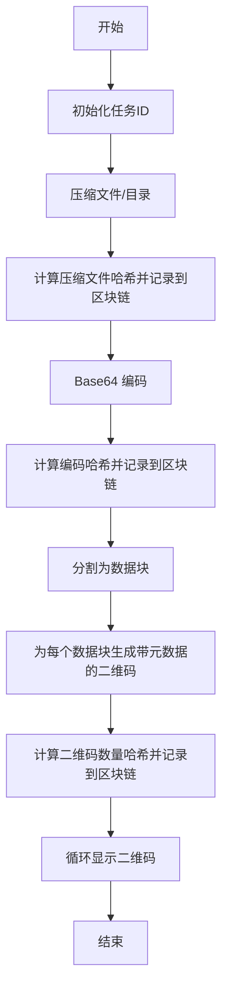

本文档详细描述了 qrcode_transfer 项目中二维码生成的完整流程，包括从输入文件到最终显示二维码的每个步骤及关键实现细节。

## 流程概览

二维码生成流程通过多个模块协作完成，包含以下核心步骤：



## 步骤详解

### 1. 任务初始化

首先生成唯一的任务ID，用于标识整个传输任务。任务ID可以通过配置文件选择随机生成或自定义模式。

```python
def generate_task_id(self):
    task_id_mode = config_manager.get('General', 'TaskIDMode', 'random')
    if task_id_mode == 'custom':
        custom_task_id = config_manager.get('General', 'CustomTaskID', '')
        if custom_task_id:
            return custom_task_id
    return f"TASK-{uuid.uuid4().hex[:8].upper()}"
```

Sources: [send.py](send.py#L23-L30)

### 2. 文件压缩

使用 zipfile 模块将输入文件或目录压缩为 zip 格式，压缩级别可通过配置文件调整。

```python
def compress(self, input_path, output_path=None):
    # ...
    with zipfile.ZipFile(output_path, 'w', compression=zipfile.ZIP_DEFLATED, 
                        compresslevel=self.compression_level) as zipf:
        if os.path.isfile(input_path):
            zipf.write(input_path, os.path.basename(input_path))
        else:
            for root, dirs, files in os.walk(input_path):
                for file in files:
                    file_path = os.path.join(root, file)
                    arcname = os.path.relpath(file_path, input_path)
                    zipf.write(file_path, arcname)
    # ...
```

Sources: [modules/compressor.py](modules/compressor.py#L17-L55)

压缩完成后，计算压缩文件的哈希值并添加到区块链中进行记录，确保数据完整性。

### 3. Base64 编码

将压缩后的文件转换为 Base64 编码字符串，便于在二维码中传输。

```python
def encode_file(self, file_path):
    with open(file_path, 'rb') as f:
        data = f.read()
        base64_str = base64.b64encode(data).decode('utf-8')
    return base64_str
```

Sources: [modules/encoder.py](modules/encoder.py#L14-L30)

同样，计算 Base64 字符串的哈希值并记录到区块链中。

### 4. 数据分块

将 Base64 编码字符串按照配置的块大小分割为多个数据块，确保每个数据块能适应单个二维码的容量限制。

```python
def split_into_blocks(self, base64_str, block_size=None):
    if block_size is None:
        block_size = self.block_size
    
    num_blocks = (len(base64_str) + block_size - 1) // block_size
    blocks = [base64_str[i*block_size : (i+1)*block_size] for i in range(num_blocks)]
    
    return blocks
```

Sources: [modules/encoder.py](modules/encoder.py#L63-L82)

### 5. 二维码生成

为每个数据块生成一个二维码，二维码中包含元数据（任务ID、总块数、当前块号、数据块哈希）以便接收端验证和重组。

```python
def generate_qr_code(self, task_id, total_blocks, current_block, data_block, output_path):
    block_hash = self.validator.calculate_hash(data_block)
    
    qr_data = {
        'task_id': task_id,
        'total_blocks': total_blocks,
        'current_block': current_block,
        'data_block': data_block,
        'block_hash': block_hash
    }
    
    qr_json = json.dumps(qr_data, ensure_ascii=False)
    
    qr = qrcode.QRCode(
        version=self.version if self.version > 0 else None,
        error_correction=self.error_correction,
        box_size=self.box_size,
        border=self.border,
    )
    
    qr.add_data(qr_json)
    qr.make(fit=True)
    
    img = qr.make_image(fill_color="black", back_color="white")
    img = img.resize((self.size, self.size), Image.LANCZOS)
    img.save(output_path, format=self.format)
```

Sources: [modules/qrcode_generator.py](modules/qrcode_generator.py#L21-L79)

生成所有二维码后，记录二维码数量的哈希值到区块链中。

### 6. 二维码显示

使用 tkinter 创建窗口循环显示所有生成的二维码，方便接收端逐个扫描。显示间隔可通过配置文件调整。

```python
def show_multiple_qr(self, qr_paths, task_id="", total_size=0):
    # 创建窗口和标签
    # ...
    
    # 启动显示线程
    self.is_running = True
    self.thread = threading.Thread(target=self._cycle_display, args=(qr_paths, task_id, total_size))
    self.thread.daemon = True
    self.thread.start()
    
    self.root.mainloop()
```

Sources: [modules/displayer.py](modules/displayer.py#L57-L88)

## 相关配置

二维码生成流程涉及以下主要配置项（可在 config.ini 中调整）：

| 配置段 | 配置项 | 说明 | 默认值 |
|--------|--------|------|--------|
| General | TaskIDMode | 任务ID生成模式（random/custom） | random |
| Compression | CompressionLevel | 压缩级别（0-9） | 9 |
| QRCode | BlockSize | 每个数据块的大小（字符数） | 2000 |
| QRCode | Version | 二维码版本（1-40，0为自动） | 1 |
| QRCode | ErrorCorrection | 纠错级别（L/M/Q/H） | H |
| QRCode | Size | 生成的二维码图片尺寸（像素） | 600 |
| QRCode | BoxSize | 二维码模块大小（像素） | 10 |
| QRCode | Border | 二维码边框大小 | 4 |
| QRCode | DisplayInterval | 循环显示间隔（秒） | 2 |

## 下一步

了解了二维码生成流程后，您可以查看以下相关文档：
- [二维码读取流程](16-er-wei-ma-du-qu-liu-cheng) - 了解如何读取和解析二维码
- [数据完整性验证](18-shu-ju-wan-zheng-xing-yan-zheng) - 深入了解数据完整性保障机制
- [压缩与编码机制](19-ya-suo-yu-bian-ma-ji-zhi) - 详细了解压缩和编码实现