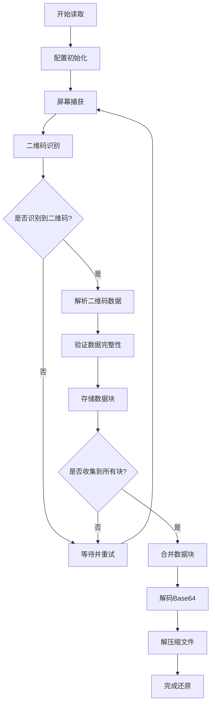
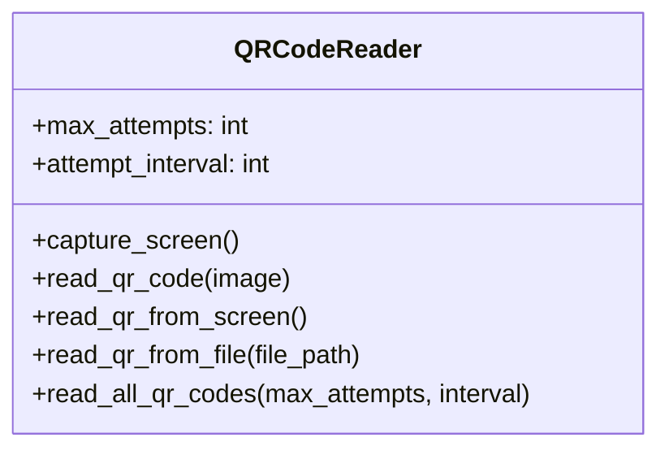
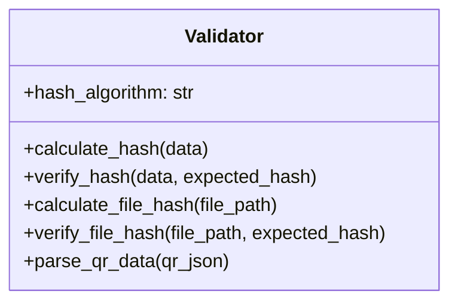
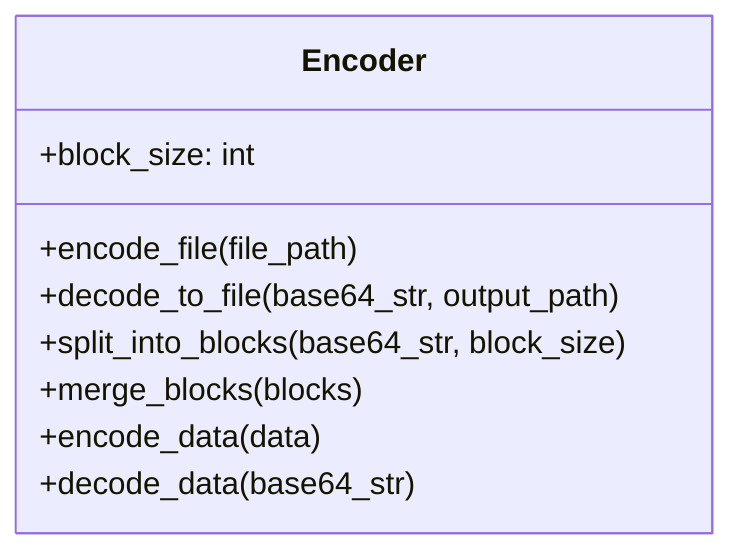

本页面详细介绍二维码读取流程，包括屏幕捕获、二维码识别、数据块收集、验证和解码的完整过程。该流程是 `qrcode_transfer` 项目接收端的核心功能，确保从二维码序列中准确还原原始数据。

## 整体流程概述

二维码读取流程是一个多步骤的数据还原过程，主要涉及屏幕捕获、二维码识别、数据块收集、完整性验证和数据解码等环节。



Sources: [qrcode_reader.py](modules/qrcode_reader.py#L1-L196), [receive.py](receive.py#L1-L124)

## 核心模块与功能

二维码读取流程由多个协同工作的模块组成，每个模块负责特定的功能。

### 二维码读取器 (QRCodeReader)

`QRCodeReader` 类是二维码读取流程的核心，负责从屏幕或文件中识别二维码，并持续收集数据块直到获取完整数据。



主要功能包括：
- **屏幕捕获**：使用 `pyautogui` 捕获屏幕图像，转换为 OpenCV 可用格式
- **二维码识别**：使用 `pyzbar` 库从图像中识别和解码二维码
- **多源读取**：支持从屏幕和图像文件两种方式读取二维码
- **持续收集**：循环读取屏幕，直到收集到完整的数据块序列

Sources: [qrcode_reader.py](modules/qrcode_reader.py#L14-L196)

### 数据验证器 (Validator)

`Validator` 类负责确保读取到的二维码数据的完整性和正确性。



主要功能包括：
- **哈希计算**：支持 SHA256、SHA512 和 MD5 三种哈希算法
- **数据验证**：验证数据块的哈希值，确保数据完整性
- **二维码解析**：解析二维码中的 JSON 数据，验证必要字段

Sources: [validator.py](modules/validator.py#L1-L155)

### 数据编码器 (Encoder)

`Encoder` 类负责数据块的合并和 Base64 解码。



主要功能包括：
- **数据块合并**：将收集到的多个数据块合并为完整的 Base64 字符串
- **Base64 解码**：将 Base64 字符串解码为原始二进制数据或文件

Sources: [encoder.py](modules/encoder.py#L1-L154)

## 详细流程步骤

### 1. 初始化与配置

流程开始时，系统会初始化必要的组件并加载配置：

```python
# 从配置文件读取参数
max_attempts = config_manager.getint('QRCodeReader', 'MaxAttempts', 30)
attempt_interval = config_manager.getint('QRCodeReader', 'AttemptInterval', 2)
```

配置参数包括最大尝试次数、尝试间隔时间等，这些参数控制二维码读取的行为。

Sources: [qrcode_reader.py](modules/qrcode_reader.py#L14-L20), [receive.py](receive.py#L22-L28)

### 2. 屏幕捕获与二维码识别

系统定期捕获屏幕图像，并尝试从中识别二维码：

```python
# 捕获屏幕
screenshot = pyautogui.screenshot()
screen_image = np.array(screenshot)
screen_image = cv2.cvtColor(screen_image, cv2.COLOR_RGB2BGR)

# 识别二维码
decoded_objects = decode(screen_image)
```

使用 `pyautogui` 捕获屏幕，转换为 OpenCV 格式后，使用 `pyzbar` 库识别二维码。

Sources: [qrcode_reader.py](modules/qrcode_reader.py#L22-L54)

### 3. 数据解析与验证

识别到二维码后，系统会解析并验证数据：

```python
# 解析二维码数据
parsed_data = validator.parse_qr_data(qr_data)
```

验证包括：
- 检查必要字段是否存在（task_id、total_blocks、current_block、data_block、block_hash）
- 验证数据块的哈希值，确保数据完整性

Sources: [qrcode_reader.py](modules/qrcode_reader.py#L56-L79), [validator.py](modules/validator.py#L114-L155)

### 4. 数据块收集

系统持续收集数据块，直到获取到完整的序列：

```python
# 存储已识别的数据块
task_data = {}
# ...
# 更新任务数据
if task_data[task_id]['blocks'][current_block - 1] is None:
    task_data[task_id]['blocks'][current_block - 1] = data_block
    task_data[task_id]['received_count'] += 1
```

系统会跟踪每个任务的数据块收集进度，确保不重复存储相同的数据块。

Sources: [qrcode_reader.py](modules/qrcode_reader.py#L125-L168)

### 5. 数据合并与解码

收集到完整的数据块后，系统会合并并解码数据：

```python
# 合并数据块
base64_str = encoder.merge_blocks(blocks)
# 解码为压缩文件
encoder.decode_to_file(base64_str, temp_zip_path)
```

首先将数据块合并为完整的 Base64 字符串，然后解码为压缩文件。

Sources: [receive.py](receive.py#L56-L65), [encoder.py](modules/encoder.py#L96-L124)

### 6. 文件解压缩与输出

最后，系统解压缩文件并输出到指定目录：

```python
# 解压缩文件
compressor.decompress(temp_zip_path, decompress_output_dir)
```

使用压缩模块将解码后的压缩文件解压到指定的输出目录，完成整个数据还原过程。

Sources: [receive.py](receive.py#L67-L72)

## 关键特性

### 容错与重试机制

系统具有完善的容错与重试机制：

| 特性 | 描述 | 配置参数 |
|------|------|----------|
| 最大尝试次数 | 控制读取二维码的最大尝试次数 | MaxAttempts |
| 尝试间隔 | 两次尝试之间的等待时间 | AttemptInterval |
| 进度提示 | 定期输出进度信息，让用户了解状态 | 每5秒 |

这种机制确保即使在二维码显示不连续或识别失败的情况下，系统仍能尽可能完成数据收集。

Sources: [qrcode_reader.py](modules/qrcode_reader.py#L101-L196)

### 数据完整性保障

系统通过多层验证确保数据完整性：

1. **单块哈希验证**：每个数据块都有对应的哈希值，验证数据块未被篡改
2. **完整数据哈希**：合并后的完整数据也会计算哈希值并记录
3. **区块链记录**：每个关键步骤都会记录到区块链，便于追溯和验证

这种多层验证机制确保了从二维码读取到文件还原的整个过程中数据的完整性和可靠性。

Sources: [validator.py](modules/validator.py#L114-L155), [receive.py](receive.py#L56-L72)

## 下一步

了解了二维码读取流程后，您可以继续探索：
- [区块链实现](17-qu-kuai-lian-shi-xian)：了解系统如何使用区块链确保数据可追溯性
- [数据完整性验证](18-shu-ju-wan-zheng-xing-yan-zheng)：深入了解数据完整性验证的机制
- [压缩与编码机制](19-ya-suo-yu-bian-ma-ji-zhi)：了解数据压缩和编码的详细实现