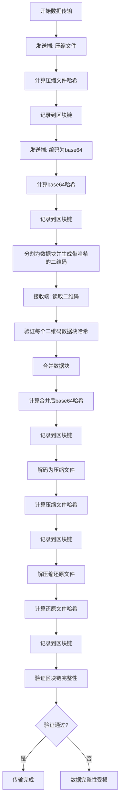

本页面详细介绍 qrcode_transfer 项目中实现的数据完整性验证机制，包括哈希算法、二维码数据块验证和区块链可追溯性三个核心层面。

## 哈希算法支持

系统提供多种哈希算法选项，用于计算和验证数据完整性，所有哈希操作均通过 `Validator` 类实现。

### 算法选择与配置

哈希算法在 `config.ini` 的 `[Blockchain]` 部分配置，默认为 SHA256，支持 SHA256、SHA512 和 MD5 三种算法：

```ini
[Blockchain]
HashAlgorithm = SHA256
```

`Validator` 类在初始化时读取配置，并根据选择动态实例化相应的哈希对象：

```python
def __init__(self):
    hash_algorithm = config_manager.get('Blockchain', 'HashAlgorithm', 'SHA256')
    self.hash_algorithm = hash_algorithm.upper()
```

Sources: [config.ini](config.ini#L44-L46), [modules/validator.py](modules/validator.py#L9-L13)

### 数据与文件哈希计算

`Validator` 类提供两种哈希计算方法：
- `calculate_hash()`：处理字符串或字节数据
- `calculate_file_hash()`：处理文件（支持大文件分块读取）

```python
def calculate_file_hash(self, file_path):
    # 根据配置选择哈希算法
    if self.hash_algorithm == 'SHA256':
        hash_obj = SHA256.new()
    # ...
    # 分块读取文件并计算哈希
    with open(file_path, 'rb') as f:
        while True:
            chunk = f.read(4096)
            if not chunk:
                break
            hash_obj.update(chunk)
    return hash_obj.hexdigest()
```

Sources: [modules/validator.py](modules/validator.py#L67-L95)

## 二维码数据块验证

在二维码读取阶段，`Validator` 类会对每个二维码数据块进行完整性验证，确保数据在传输过程中未被篡改。

### 验证流程

二维码数据块验证包含两个关键步骤：
1. **字段完整性验证**：检查必需字段是否存在
2. **哈希值验证**：验证数据块内容与存储的哈希值是否匹配

```python
def parse_qr_data(self, qr_json):
    data = json.loads(qr_json)
    # 验证数据完整性
    required_fields = ['task_id', 'total_blocks', 'current_block', 'data_block', 'block_hash']
    for field in required_fields:
        if field not in data:
            raise ValueError(f"二维码数据缺少必要字段: {field}")
    # 验证数据块哈希
    if not self.verify_hash(data['data_block'], data['block_hash']):
        raise ValueError(f"二维码数据块哈希验证失败")
    return data
```

Sources: [modules/validator.py](modules/validator.py#L113-L155)

## 区块链可追溯性

系统使用轻量级区块链结构记录关键操作的哈希值，提供完整的数据传输追溯能力。

### 区块结构

每个区块包含以下核心信息：
- 时间戳
- 操作类型（compress、encode、generate_qr、decode、decompress、restore）
- 任务ID
- 数据哈希
- 前一个区块的哈希
- 当前区块哈希

```python
class Block:
    def __init__(self, timestamp, operation_type, task_id, data_hash, previous_hash=''):
        self.timestamp = timestamp
        self.operation_type = operation_type
        self.task_id = task_id
        self.data_hash = data_hash
        self.previous_hash = previous_hash
        self.hash = self.calculate_hash()
```

Sources: [modules/blockchain.py](modules/blockchain.py#L10-L20)

### 区块链完整性验证

`Blockchain` 类提供 `is_chain_valid()` 方法，验证整个区块链的完整性，包括：
1. 创世块哈希验证
2. 每个区块自身哈希验证
3. 区块间哈希链接验证

```python
def is_chain_valid(self):
    # 验证创世块
    if len(self.chain) > 0:
        genesis_block = self.chain[0]
        if genesis_block.hash != genesis_block.calculate_hash():
            return False
    # 验证其他块
    for i in range(1, len(self.chain)):
        current_block = self.chain[i]
        previous_block = self.chain[i-1]
        if current_block.hash != current_block.calculate_hash():
            return False
        if current_block.previous_hash != previous_block.hash:
            return False
    return True
```

Sources: [modules/blockchain.py](modules/blockchain.py#L175-L202)

### 数据传输流程中的区块链记录

在数据发送和接收过程中，系统会自动在关键节点将操作记录到区块链中：

**发送端流程**（send.py）：
1. 压缩文件 → 记录 compress 操作
2. 编码为 base64 → 记录 encode 操作
3. 生成二维码 → 记录 generate_qr 操作

**接收端流程**（receive.py）：
1. 解码 base64 → 记录 decode 操作
2. 解压缩文件 → 记录 decompress 操作
3. 还原文件 → 记录 restore 操作

Sources: [send.py](send.py#L45-L65), [receive.py](receive.py#L55-L73)

## 验证流程图

下面是数据完整性验证的整体流程：



## 相关页面

- [区块链实现](17-qu-kuai-lian-shi-xian)
- [二维码生成流程](15-er-wei-ma-sheng-cheng-liu-cheng)
- [二维码读取流程](16-er-wei-ma-du-qu-liu-cheng)
- [验证区块链完整性](7-yan-zheng-qu-kuai-lian-wan-zheng-xing)