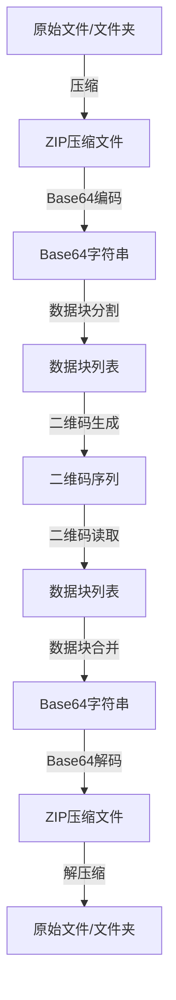

本页面详细说明 qrcode_transfer 项目中使用的压缩与编码机制，包括文件压缩、Base64 编码以及数据块分割策略。该机制是实现文件通过二维码传输的核心技术基础。

## 整体架构与数据流程
压缩与编码机制构成了项目数据处理的核心流水线，通过模块化设计实现数据的高效转换和管理。
下面是完整的数据处理流程图：


## 压缩机制
项目使用标准 ZIP 格式进行文件压缩，通过 `Compressor` 类实现完整的压缩与解压缩功能。压缩模块采用 Python 内置的 `zipfile` 库，使用 DEFLATED 算法提供高效的压缩性能。
Sources: [compressor.py](modules/compressor.py#L1-L97)

### 核心功能
压缩模块支持两种主要操作模式：
- **文件压缩**：可处理单个文件或整个目录结构
- **文件解压缩**：将 ZIP 文件还原到指定目录

压缩级别通过配置文件中的 `CompressionLevel` 参数控制，范围为 0-9，其中 0 表示无压缩，9 表示最高压缩率。系统默认使用最高压缩级别（9）以最小化数据体积。
Sources: [compressor.py](modules/compressor.py#L8-L10)

```python
# 压缩核心实现
with zipfile.ZipFile(output_path, 'w', compression=zipfile.ZIP_DEFLATED, 
                    compresslevel=self.compression_level) as zipf:
    # 压缩单个文件或遍历文件夹
```
Sources: [compressor.py](modules/compressor.py#L28-L36)

### 目录处理
对于目录压缩，系统使用递归遍历方式，保留完整的目录结构。通过 `os.walk()` 函数遍历目录树，使用 `os.path.relpath()` 计算相对路径，确保解压后能正确恢复原始文件结构。
Sources: [compressor.py](modules/compressor.py#L37-L42)

### 错误处理机制
压缩模块具备完善的错误处理机制，当压缩过程中发生异常时，会自动清理可能产生的不完整压缩文件，确保系统状态的一致性。
Sources: [compressor.py](modules/compressor.py#L44-L53)

## 编码机制
项目采用 Base64 编码将二进制文件转换为文本格式，便于在二维码中存储和传输。`Encoder` 类提供完整的编码、解码以及数据块管理功能。
Sources: [encoder.py](modules/encoder.py#L1-L154)

### Base64 编码转换
编码模块实现了双向转换功能：
- **文件到 Base64**：读取二进制文件内容，转换为 UTF-8 编码的 Base64 字符串
- **Base64 到文件**：将 Base64 字符串解码为二进制数据并写入文件
- **二进制数据到 Base64**：直接处理二进制数据的编码与解码

```python
# 文件编码核心实现
with open(file_path, 'rb') as f:
    data = f.read()
    base64_str = base64.b64encode(data).decode('utf-8')
```
Sources: [encoder.py](modules/encoder.py#L23-L30)

### 数据块分割与合并
为适应二维码的数据容量限制，系统将大型 Base64 字符串分割为固定大小的数据块。块大小通过配置文件中的 `BlockSize` 参数控制，默认为 1000 字符。
Sources: [encoder.py](modules/encoder.py#L9-L11)

分割算法采用简单的字符串切片方法，确保每个块大小一致（最后一个块可能较小）。合并操作则按顺序连接所有数据块，恢复原始 Base64 字符串，同时包含数据块类型和空值检查，保障数据的完整性。
Sources: [encoder.py](modules/encoder.py#L106-L115)

```python
# 数据块分割核心实现
blocks = [base64_str[i*block_size : (i+1)*block_size] for i in range(num_blocks)]
```
Sources: [encoder.py](modules/encoder.py#L78-L84)

## 工作流程集成
压缩与编码机制在主流程中紧密协作，形成完整的数据处理流水线。

### 生成流程
在二维码生成阶段，数据流向为：
1. **压缩**：原始文件/文件夹 → ZIP 压缩文件
2. **编码**：ZIP 文件 → Base64 字符串
3. **分割**：Base64 字符串 → 数据块列表
4. **二维码生成**：每个数据块 → 单独的二维码图片

每个步骤都通过区块链模块记录哈希值，确保数据完整性可追溯。
Sources: [main.py](main.py#L61-L94)

### 读取流程
在二维码读取还原阶段，流程逆向执行：
1. **读取**：扫描二维码 → 数据块列表
2. **合并**：数据块列表 → 完整 Base64 字符串
3. **解码**：Base64 字符串 → ZIP 文件
4. **解压缩**：ZIP 文件 → 原始文件/文件夹

同样，每个关键步骤都会记录哈希值到区块链，用于后续完整性验证。
Sources: [main.py](main.py#L118-L150)

## 配置选项
压缩与编码机制的行为可通过配置文件中的以下参数调整：

| 配置项 | 所属章节 | 默认值 | 说明 |
|-------|---------|-------|------|
| CompressionLevel | Compression | 9 | 压缩级别（0-9，0=无压缩，9=最高压缩） |
| BlockSize | QRCode | 1000 | 每个二维码包含的数据块大小（字符数） |

这些配置直接影响传输效率和二维码数量，可根据具体需求进行平衡调整。
Sources: [config.ini](config.ini#L8-L9)
Sources: [config.ini](config.ini#L24-L25)

## 技术特点
该压缩与编码机制具有以下技术特点：
- **标准兼容性**：使用行业标准 ZIP 和 Base64 格式，确保数据可在其他系统中处理
- **可配置性**：关键参数可通过配置文件调整，适应不同场景需求
- **完整性保障**：每个处理步骤都有哈希记录，配合区块链机制确保数据未被篡改
- **错误恢复**：数据块分割策略允许部分重传，提高传输可靠性

通过这种设计，项目成功地将任意大小的文件转换为可通过二维码序列传输的形式，同时保持了数据的完整性和可验证性。