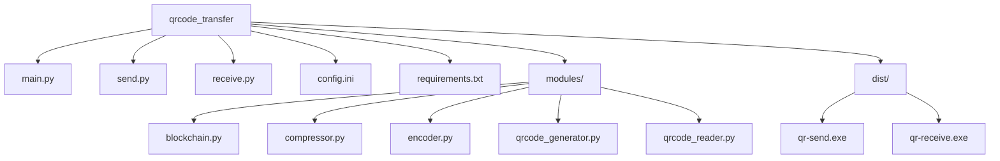
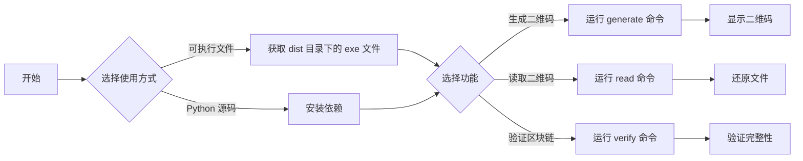

本页面将帮助你快速了解和使用 QR Code 文件传输工具，包括两种使用方式（可执行文件和 Python 源码）的基本步骤和核心流程。

## 项目结构概览

首先，让我们了解项目的核心结构，这将帮助你快速定位关键文件：



## 使用方式选择

本工具提供两种使用方式，你可以根据自己的需求选择：

| 使用方式 | 优点 | 适用场景 |
|----------|------|----------|
| 可执行文件 | 无需安装 Python，开箱即用 | 快速使用、非技术用户 |
| Python 源码 | 可自定义、可调试 | 开发、修改功能 |

## 方式一：使用可执行文件（推荐）

### 步骤 1：获取可执行文件

在 `dist` 目录下找到以下两个文件：
- `qr-send.exe`：用于生成二维码（发送端）
- `qr-receive.exe`：用于读取二维码（接收端）

将这两个文件复制到你想要使用的任意目录。

### 步骤 2：首次运行

首次运行任一可执行文件时，程序会自动在同级目录生成 `config.ini` 配置文件。你可以根据需要修改该文件中的参数（详见 [配置文件概览](8-pei-zhi-wen-jian-gai-shu)）。

### 步骤 3：生成并显示二维码（发送端）

打开命令提示符（CMD）或 PowerShell，进入可执行文件所在目录，运行：

```bash
qr-send.exe generate -i <要传输的文件或文件夹路径>
```

例如：
```bash
qr-send.exe generate -i test.txt
```

程序会自动压缩文件、生成二维码并循环显示。

Sources: [send.py](send.py#L1-L156)

### 步骤 4：读取二维码还原文件（接收端）

在另一台设备（或同一设备的另一个终端窗口），进入可执行文件所在目录，运行：

```bash
qr-receive.exe read -o <输出目录>
```

例如：
```bash
qr-receive.exe read -o output
```

程序会自动从屏幕捕获二维码，并将还原的文件保存到 `<输出目录>/restored_<任务ID>` 目录中。

Sources: [receive.py](receive.py#L1-L124)

## 方式二：使用 Python 源码

### 步骤 1：环境准备

确保你已经安装了 Python 3.8 或更高版本。你可以从 [Python 官网](https://www.python.org/) 下载并安装。

### 步骤 2：安装依赖

进入项目目录，运行以下命令安装依赖：

```bash
pip install -r requirements.txt
```

Sources: [requirements.txt](requirements.txt)

### 步骤 3：生成并显示二维码（发送端）

运行以下命令：

```bash
python send.py generate -i <要传输的文件或文件夹路径>
```

例如：
```bash
python send.py generate -i test.txt
```

Sources: [send.py](send.py#L1-L156)

### 步骤 4：读取二维码还原文件（接收端）

运行以下命令：

```bash
python receive.py read -o <输出目录>
```

例如：
```bash
python receive.py read -o output
```

Sources: [receive.py](receive.py#L1-L124)

## 快速使用流程

下面是使用本工具的完整流程图：



## 验证区块链完整性

无论使用哪种方式，你都可以验证操作记录的完整性：

- **可执行文件方式**：
  ```bash
  qr-receive.exe verify
  ```

- **Python 源码方式**：
  ```bash
  python receive.py verify
  ```

这会检查哈希链的完整性，确保所有操作记录未被篡改。

Sources: [receive.py](receive.py#L1-L124)

## 下一步

现在你已经完成了基本的使用！接下来你可以：
- 查看 [环境配置](3-huan-jing-pei-zhi) 了解如何配置开发环境
- 查看 [安装依赖](4-an-zhuang-yi-lai) 了解依赖详情
- 查看 [生成二维码](5-sheng-cheng-er-wei-ma) 了解更多生成二维码的选项
- 查看 [读取二维码](6-du-qu-er-wei-ma) 了解更多读取二维码的选项