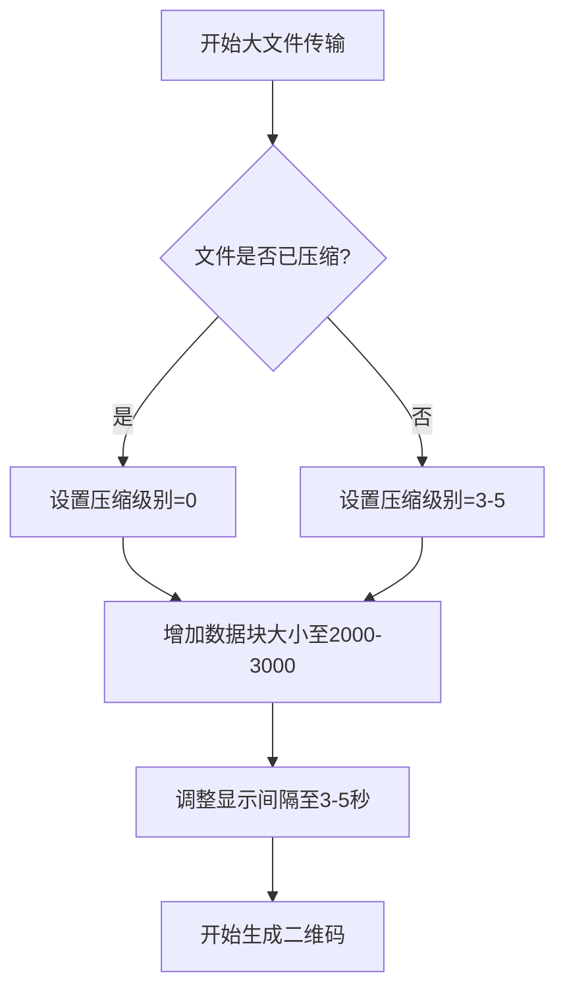

本页面提供了使用 QRCode 文件传输工具的最佳实践指南，帮助您在各种场景下高效、可靠地完成文件传输任务。

## 配置最佳实践

### 二维码配置优化

根据文件大小和传输环境选择合适的二维码配置是保证传输成功的关键。对于小文件（<100KB），建议使用更高的容错率以提高识别成功率；对于大文件，建议增加数据块大小以减少二维码数量。

| 文件大小范围 | 推荐数据块大小 | 推荐容错率 | 预期二维码数量 |
|-------------|----------------|-----------|--------------|
| < 100KB     | 500-1000 字节  | H (30%)   | 1-10 个      |
| 100KB-1MB   | 1000-2000 字节 | M (15%)   | 10-100 个    |
| 1-10MB      | 2000-3000 字节 | Q (25%)   | 100-500 个   |
| >10MB       | 3000-5000 字节 | M (15%)   | 500+ 个      |

二维码大小建议设置在 400-800 像素之间，过小可能导致识别困难，过大则会增加传输时间。边框大小建议保持默认的 4 个模块，这可以提供足够的空白区域以提高识别率。

Sources: [config.ini](config.ini#L13-L27)
Sources: [modules/qrcode_generator.py](modules/qrcode_generator.py#L12-L19)

### 压缩配置选择

压缩级别的选择需要在压缩率和处理时间之间取得平衡。对于文本文件、代码文件等可高度压缩的内容，建议使用较高的压缩级别（7-9）。对于已经压缩过的文件（如 JPEG、ZIP 等），建议使用较低的压缩级别（0-3）以节省处理时间。

```ini
[Compression]
# 文本文件、源代码
CompressionLevel = 9

# 已压缩文件、多媒体文件
CompressionLevel = 2

# 追求速度，不关心压缩率
CompressionLevel = 0
```

压缩配置会直接影响生成的二维码数量和处理时间，请根据实际需求进行调整。

Sources: [config.ini](config.ini#L9-L12)
Sources: [modules/compressor.py](modules/compressor.py#L8-L10)

## 性能优化最佳实践

### 大文件传输策略

对于大文件传输，性能优化尤为重要。首先，建议适当增加数据块大小，这可以显著减少二维码数量。同时，考虑降低压缩级别以加快处理速度。最后，调整二维码显示间隔，确保有足够时间完成识别。



对于特别大的文件（>50MB），建议考虑分割成多个较小的压缩包分别传输，这样可以降低单次传输失败的风险，并且在部分传输失败时只需重传失败部分。

Sources: [modules/qrcode_generator.py](modules/qrcode_generator.py#L94-L120)
Sources: [main.py](main.py#L57-L101)

### 内存使用优化

该工具在处理大文件时可能会占用较多内存。要优化内存使用，可以增大数据块大小以减少需要同时处理的数据块数量，同时避免同时加载所有二维码到内存中。在 `qrcode_generator.py` 中，我们可以看到工具采用了逐个生成二维码的方式。

另外，确保临时目录和输出目录位于有足够可用空间的磁盘分区上，特别是在处理大文件时。临时文件会在任务完成后自动清理，但在传输过程中需要足够的磁盘空间。

Sources: [main.py](main.py#L39-L42)
Sources: [modules/compressor.py](modules/compressor.py#L22-L27)

## 可靠性保障最佳实践

### 数据完整性验证

工具内置了多层数据完整性验证机制，确保传输的数据不被篡改。每个数据块都有独立的哈希值验证，同时整个文件也有最终哈希验证。为了最大程度地保障数据完整性，建议：

1. 保持区块链功能启用（默认已启用）
2. 使用 SHA256 或 SHA512 哈希算法（避免使用 MD5，除非有兼容性要求）
3. 传输完成后运行验证命令检查区块链完整性

```bash
python main.py verify
```

验证器模块会检查每个数据块的哈希值，确保数据在传输过程中没有被篡改。如果验证失败，工具会记录详细的日志信息，帮助定位问题。

Sources: [modules/validator.py](modules/validator.py#L55-L93)
Sources: [config.ini](config.ini#L42-L46)

### 容错与恢复策略

在实际使用中，可能会遇到各种问题导致传输不完整。以下是一些应对策略：

1. **二维码识别失败**：调整光线条件、确保二维码平整无扭曲、调整摄像头角度，或者重新生成二维码时使用更高的容错率。
2. **部分二维码丢失**：由于每个二维码都包含元数据，工具能够识别缺失的块。重新显示二维码时，工具会自动跳过已成功读取的部分。
3. **程序意外中断**：由于生成的二维码文件保存在输出目录中，可以使用 `display` 命令重新显示已生成的二维码，无需重新生成。

```bash
# 重新显示已生成的二维码
python main.py display --path output/qr_TASK-XXXXXX
```

Sources: [main.py](main.py#L201-L231)
Sources: [modules/qrcode_reader.py](modules/qrcode_reader.py)

## 环境准备最佳实践

### 物理环境设置

二维码传输的成功很大程度上依赖于物理环境。建议：

1. **光线条件**：确保光线充足且均匀，避免强烈的直射光和阴影。
2. **显示设备**：使用高分辨率显示器，亮度适中，对比度高。
3. **拍摄设备**：使用高质量摄像头，保持稳定，避免抖动。
4. **距离控制**：保持摄像头与二维码的适当距离，通常为 20-50 厘米，具体取决于二维码大小。

在显示二维码时，工具会自动调整显示间隔，但您也可以根据实际识别速度手动调整配置文件中的 `DisplayInterval` 参数。

Sources: [config.ini](config.ini#L25-L26)

### 系统资源准备

在开始传输任务前，确保系统有足够的资源：

1. **内存**：建议至少 4GB 可用内存，处理大文件时建议 8GB 以上。
2. **磁盘空间**：确保临时目录和输出目录所在分区有足够的可用空间，建议至少为传输文件大小的 3-5 倍。
3. **CPU**：压缩和二维码生成是计算密集型操作，建议使用现代多核处理器以提高速度。

您可以通过任务管理器或系统监控工具在传输过程中观察资源使用情况，必要时调整配置参数。

Sources: [modules/config_manager.py](modules/config_manager.py#L52-L60)

## 安全最佳实践

### 哈希链安全使用

工具提供的区块链（哈希链）功能可以确保操作的可追溯性。为了最大化安全性：

1. 不要手动编辑 `hash_chain.json` 文件，这会破坏链的完整性。
2. 定期备份哈希链文件，特别是在重要传输任务前后。
3. 使用强哈希算法（SHA256 或 SHA512），避免使用 MD5。
4. 在敏感环境中，可以考虑将哈希链文件存储在只读介质上。

验证区块链完整性只需运行简单的命令，建议在每次重要传输后都进行验证。

Sources: [modules/blockchain.py](modules/blockchain.py)
Sources: [config.ini](config.ini#L42-L46)

### 敏感数据传输注意事项

虽然工具提供了数据完整性验证，但不提供数据加密功能。对于敏感数据的传输：

1. 考虑在使用本工具前先使用其他工具对数据进行加密。
2. 确保物理传输环境安全，避免二维码被未授权方拍摄。
3. 传输完成后及时清理临时文件和二维码图像（工具会自动清理临时文件，但输出目录中的二维码需要手动处理）。
4. 对于极高安全要求的场景，考虑使用自定义任务ID并在传输后立即销毁二维码文件。

Sources: [main.py](main.py#L95-L100)
Sources: [main.py](main.py#L185-L190)

## 下一步

了解了最佳实践后，您可能想要查看以下内容：

- [常见问题](20-chang-jian-wen-ti) - 了解使用过程中可能遇到的常见问题及解决方案
- [故障排除](21-gu-zhang-pai-chu) - 学习如何诊断和解决具体问题
- [安全考虑](23-an-quan-kao-lv) - 深入了解安全相关的注意事项和建议