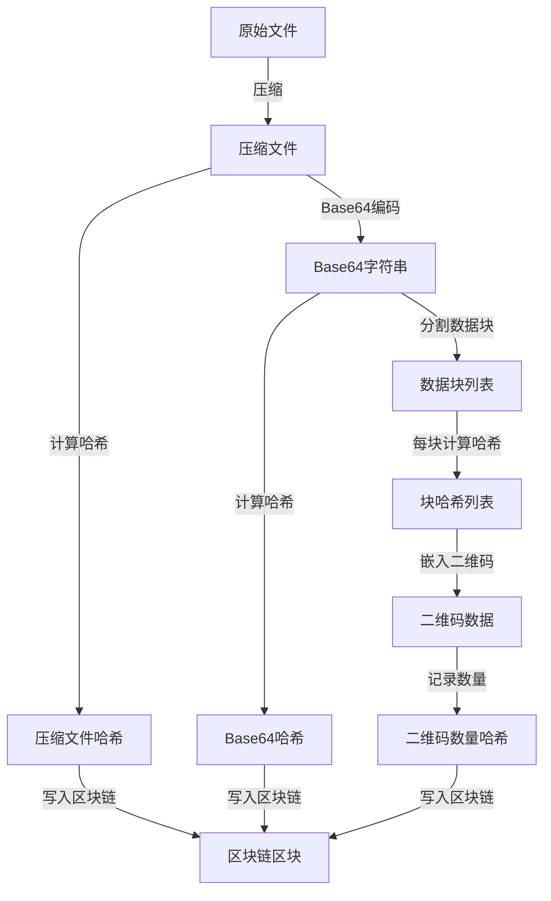
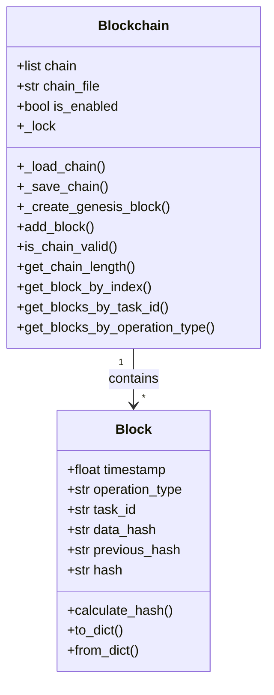

本页面详细介绍二维码文件传输系统中的安全机制，包括数据完整性保护、哈希链验证以及配置安全选项，为高级开发者提供全面的安全实现解析。

## 数据完整性保护

系统通过多层次的哈希计算与验证机制，确保数据在传输过程中的完整性。每个关键操作步骤都会生成对应的哈希值并记录到区块链中：

- **文件压缩阶段**：对压缩后的文件计算哈希值，确保文件压缩前后的一致性
- **Base64编码阶段**：对编码后的字符串计算哈希，防止编码过程中数据损坏
- **数据块分割阶段**：每个数据块独立计算哈希并嵌入二维码，确保单块数据完整性
- **二维码生成阶段**：记录生成的二维码数量，确保输出结果的完整性

哈希计算支持多种算法，包括 SHA256（默认）、SHA512 和 MD5，可根据安全需求进行选择。系统使用 `Crypto.Hash` 库实现哈希计算，确保密码学安全性。

Sources: [main.py](main.py#L55-L120), [modules/validator.py](modules/validator.py#L1-L155)

## 区块链（哈希链）验证

系统实现了轻量级的哈希链（Blockchain）机制，用于记录和追溯整个数据传输流程：

- **创世块**：系统启动时自动创建，作为哈希链的起点
- **操作记录**：每个关键操作（压缩、编码、二维码生成等）都会创建新的区块
- **链接机制**：每个新区块包含前一个区块的哈希值，形成不可篡改的链式结构
- **持久化存储**：哈希链保存在 `hash_chain.json` 文件中，采用"先写临时文件再重命名"的策略防止写入中断导致文件损坏
- **并发安全**：使用线程锁确保多线程环境下的哈希链写入安全

通过哈希链，可以验证整个传输流程的完整性，防止数据被篡改或操作被伪造。

Sources: [modules/blockchain.py](modules/blockchain.py#L1-L249)

## 配置安全选项

系统提供了灵活的安全配置选项，可在 `config.ini` 文件中进行调整：

| 配置项 | 说明 | 可选值 | 默认值 | 安全建议 |
|--------|------|--------|--------|----------|
| Blockchain.Enabled | 是否启用哈希链功能 | True/False | True | 保持启用以获得完整审计追踪 |
| Blockchain.HashAlgorithm | 哈希算法选择 | SHA256/SHA512/MD5 | SHA256 | 高安全场景使用 SHA512，避免 MD5 |
| Blockchain.ChainFile | 哈希链文件存储路径 | 任意有效路径 | hash_chain.json | 限制文件访问权限，定期备份 |
| Log.LogLevel | 日志级别 | DEBUG/INFO/WARNING/ERROR/CRITICAL | INFO | 生产环境使用 INFO 或 WARNING |
| Log.LogFile | 日志文件路径 | 任意有效路径 | qrcode_transfer.log | 限制文件访问权限，定期归档 |

Sources: [config.ini](config.ini#L1-L55)

## 安全最佳实践

为确保系统在使用过程中的安全性，建议遵循以下最佳实践：

1. **定期备份哈希链**：定期备份 `hash_chain.json` 文件，防止意外丢失
2. **选择合适的哈希算法**：根据安全需求选择适当的哈希算法，SHA512 提供最高安全性
3. **保护配置文件**：限制 `config.ini` 文件的访问权限，防止未经授权的修改
4. **监控日志文件**：定期检查 `qrcode_transfer.log` 日志文件，及时发现异常操作
5. **验证数据完整性**：在接收完成后，使用 [验证区块链完整性](7-yan-zheng-qu-kuai-lian-wan-zheng-xing) 功能确保数据未被篡改
6. **安全存储临时文件**：确保临时文件目录（默认 `temp`）的访问权限受限，系统会自动清理临时文件但仍需注意
7. **隔离生产环境**：在生产环境中使用独立的用户账户运行系统，避免使用管理员权限

## 下一步

了解了安全机制后，您可能还想查看：

- [验证区块链完整性](7-yan-zheng-qu-kuai-lian-wan-zheng-xing)：学习如何验证数据传输的完整性
- [区块链实现](17-qu-kuai-lian-shi-xian)：深入了解哈希链的技术实现细节
- [最佳实践](22-zui-jia-shi-jian)：获取更多系统使用的最佳实践建议