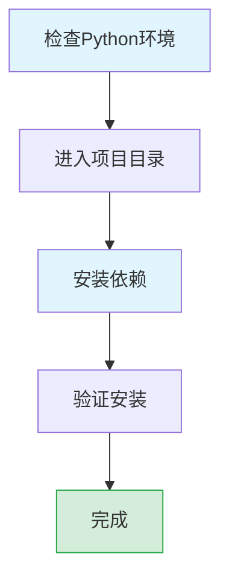

本页面将帮助您安装项目所需的所有依赖项，确保二维码文件传输程序能够正常运行。我们将详细介绍每个依赖的作用，并提供完整的安装流程。

## 环境要求

在开始安装依赖之前，请确保您的环境满足以下条件：

- **Python 版本**: Python 3.7 或更高版本
- **操作系统**: Windows、macOS 或 Linux
- **开发工具**: pip (Python 包管理器)

## 依赖项详解

项目的依赖关系主要在 `requirements.txt` 文件中定义，以下是各依赖项的详细说明：

| 依赖包 | 版本要求 | 主要用途 |
|--------|----------|----------|
| qrcode[pil] | &gt;=7.4.2,&lt;8.0.0 | 生成二维码图片 |
| pyzbar | &gt;=0.1.9,&lt;0.2.0 | 解码二维码内容 |
| opencv-python | &gt;=4.8.0,&lt;5.0.0 | 图像处理与屏幕捕获 |
| pyautogui | &gt;=0.9.54,&lt;0.10.0 | 屏幕捕获与自动化操作 |
| pycryptodome | &gt;=3.19.0,&lt;4.0.0 | 加密与哈希计算 |
| pillow | &gt;=10.0.0,&lt;11.0.0 | 图像处理基础库 |
| configparser | &gt;=5.3.0,&lt;6.0.0 | 配置文件管理 |
| numpy | &gt;=1.24.0,&lt;2.0.0 | 数值计算与数组处理 |

Sources: [requirements.txt](requirements.txt#L1-L8)

## 安装步骤

以下是完整的安装步骤，确保您能够正确配置环境：



### 步骤 1: 检查 Python 环境

首先，确保您的系统已安装 Python 3.7 或更高版本：

```bash
python --version
# 或
python3 --version
```

### 步骤 2: 进入项目目录

打开终端或命令提示符，导航到项目的根目录：

```bash
cd C:\Users\pengfei.ma\Desktop\CODE\Python\qrcode_transfer
```

### 步骤 3: 安装依赖

使用 pip 安装项目的所有依赖：

```bash
pip install -r requirements.txt
```

**注意**：如果您使用的是 macOS 或 Linux，可能需要使用 `pip3` 代替 `pip`。

Sources: [README.md](README.md#L75-L80)

## 验证安装

安装完成后，您可以通过以下方式验证依赖是否安装正确：

```bash
python -c "import qrcode, cv2, Crypto; print('依赖安装成功！')"
```

如果没有错误提示，说明依赖安装成功。您可以继续进行下一步。

## 常见问题与解决方法

### 1. opencv-python 安装失败

**问题**：在某些系统中，opencv-python 可能安装失败。

**解决方案**：

- 尝试使用预编译的二进制包：`pip install --only-binary :all: opencv-python`
- 或者安装简化版本：`pip install opencv-python-headless`

### 2. pyzbar 相关问题

**问题**：在 Windows 系统中，pyzbar 可能需要额外的 Visual C++ 运行时。

**解决方案**：
- 安装 [Microsoft Visual C++ Redistributable](https://aka.ms/vs/17/release/vc_redist.x64.exe)
- 对于 macOS，需要先安装 zbar：`brew install zbar`

### 3. 权限问题

**问题**：安装过程中出现权限错误。

**解决方案**：
- 使用用户目录安装：`pip install --user -r requirements.txt`
- 或者使用虚拟环境（推荐）

## 使用虚拟环境（推荐）

为了避免依赖冲突，我们强烈建议使用 Python 虚拟环境：

### 创建和激活虚拟环境

```bash
# 创建虚拟环境
python -m venv venv

# 激活虚拟环境 (Windows)
venv\Scripts\activate

# 激活虚拟环境 (macOS/Linux)
source venv/bin/activate
```

激活虚拟环境后，再执行 `pip install -r requirements.txt` 安装依赖。

## 构建依赖（可选）

如果您需要自行打包项目为可执行文件，还需要安装 PyInstaller：

```bash
pip install pyinstaller
```

Sources: [build.bat](build.bat#L10-L16)

## 下一步操作

依赖安装完成后，您可以继续阅读以下文档：

- [生成二维码](5-sheng-cheng-er-wei-ma) - 了解如何将文件编码为二维码
- [读取二维码](6-du-qu-er-wei-ma) - 学习如何从屏幕读取二维码并还原文件
- [配置文件概览](8-pei-zhi-wen-jian-gai-shu) - 自定义程序的各种配置选项