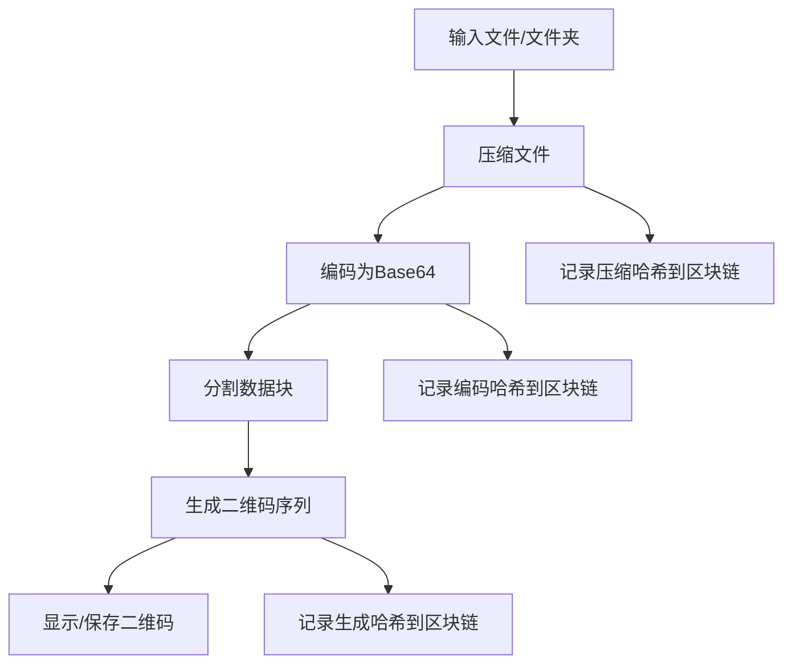

本页面将详细介绍如何使用 qrcode_transfer 项目生成二维码，包括完整的使用流程、工作原理和配置说明。

## 功能概述

"生成二维码"功能是 qrcode_transfer 项目的核心功能之一，它通过一系列数据处理步骤，将任意文件或文件夹转换为可传输的二维码序列。这一功能主要由 `send.py` 脚本提供，支持从命令行直接使用。

Sources: [send.py](send.py#L1-L156)

## 使用方法

### 基本命令

使用 `send.py` 脚本的 `generate` 子命令即可生成二维码：

```bash
python send.py generate --input <文件或文件夹路径>
```

### 参数说明

| 参数 | 简写 | 必需 | 说明 |
|------|------|------|------|
| --input | -i | 是 | 输入文件或文件夹的路径 |
| --task-id | -t | 否 | 自定义任务ID，便于识别和后续处理 |
| --no-display | - | 否 | 跳过二维码显示步骤，仅生成二维码文件 |

### 显示已有二维码

如需要再次显示已经生成的二维码，可以使用 `display` 子命令：

```bash
python send.py display --path <二维码文件或目录路径>
```

Sources: [send.py](send.py#L118-L156)

## 工作流程

二维码生成过程遵循清晰的数据处理流水线，主要包含以下步骤：



### 详细步骤说明

1. **压缩文件**：使用 zip 格式压缩输入文件或文件夹，便于后续处理和传输。
   
2. **编码为 Base64**：将压缩后的文件转换为 Base64 编码的文本字符串，使其可以嵌入到二维码中。

3. **分割数据块**：将长 Base64 字符串按照配置的块大小分割成多个数据块，确保每个数据块可以放入单个二维码中。

4. **生成二维码序列**：为每个数据块生成一个二维码，包含任务ID、块编号、总块数、数据内容和哈希校验值。

5. **显示/保存二维码**：将生成的二维码保存到输出目录，并可选择在屏幕上显示以便扫描。

Sources: [send.py](send.py#L40-L86)

## 二维码数据结构

每个生成的二维码都包含以下结构化数据：

```json
{
  "task_id": "任务标识符",
  "total_blocks": 总块数,
  "current_block": 当前块号,
  "data_block": "数据块内容",
  "block_hash": "数据块哈希值"
}
```

这种设计确保了即使二维码被无序扫描，接收端也能正确重组数据并验证完整性。

Sources: [modules/qrcode_generator.py](modules/qrcode_generator.py#L28-L67)

## 配置选项

可以通过修改 `config.ini` 文件中的 `[QRCode]` 部分来调整二维码生成参数：

| 配置项 | 默认值 | 说明 |
|--------|--------|------|
| Version | 1 | 二维码版本 (1-40)，0 表示自动选择 |
| ErrorCorrection | M | 容错级别 (L=7%, M=15%, Q=25%, H=30%) |
| Size | 600 | 二维码图片大小（像素） |
| BoxSize | 10 | 每个二维码模块的像素数 |
| Border | 4 | 边框大小（模块数） |
| Format | PNG | 输出图片格式 |
| BlockSize | 1000 | 每个二维码包含的数据块大小（字节） |
| DisplayInterval | 2 | 显示多个二维码时的切换间隔（秒） |

Sources: [config.ini](config.ini#L16-L29)

## 输出文件

生成的二维码会保存到 `output` 目录下的 `qr_<任务ID>` 子目录中，文件命名格式为：
```
<任务ID>_block_<当前块号>_<总块数>.png
```

例如：`TASK-1234ABCD_block_1_10.png` 表示任务 TASK-1234ABCD 的第 1 个二维码，共 10 个。

Sources: [modules/qrcode_generator.py](modules/qrcode_generator.py#L109-L122)

## 下一步

完成二维码生成后，你可能需要了解：

- [读取二维码](6-du-qu-er-wei-ma)：学习如何扫描和解析生成的二维码
- [二维码配置](9-er-wei-ma-pei-zhi)：深入了解二维码配置选项的详细说明
- [区块链配置](11-qu-kuai-lian-pei-zhi)：了解如何启用和配置哈希链功能