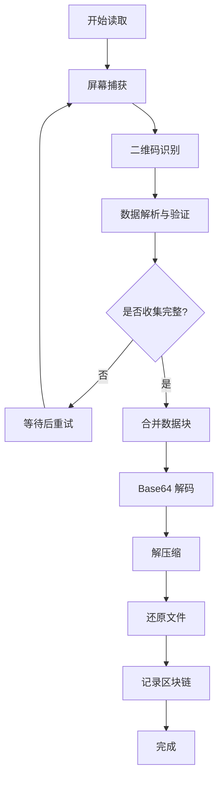

本页面详细介绍 QR Code 文件传输工具的接收端功能，包括如何从屏幕读取二维码并还原原始文件。接收端是整个工具的核心组件之一，与发送端配合使用，实现安全、便捷的文件传输。

## 功能概述

接收端主要负责从屏幕捕获二维码图像、解析其中包含的数据、验证数据完整性，并最终还原为原始文件或文件夹。整个过程采用分步骤的方式，确保数据传输的安全性和完整性。

### 核心功能特性：
- **屏幕捕获**：自动捕获屏幕图像，无需手动选择区域
- **智能识别**：支持同时识别多个二维码，自动处理多任务
- **数据验证**：对每个数据块进行哈希验证，确保数据完整性
- **进度显示**：实时显示接收进度，让用户了解当前状态
- **区块链记录**：每一步操作都会记录到哈希链，确保可追溯性

Sources: [receive.py](receive.py#L1-L124)

## 使用方法

接收端提供两种使用方式：使用预编译的可执行文件（推荐）和使用 Python 源码运行。两种方式的功能完全一致。

### 可执行文件方式

将 `qr-receive.exe` 复制到任意目录后，使用以下命令：

```bash
# 读取屏幕二维码并还原文件
qr-receive.exe read -o <输出目录>

# 验证区块链完整性
qr-receive.exe verify
```

### Python 源码方式

确保已安装 Python 3.8+ 和项目依赖后，使用以下命令：

```bash
# 读取屏幕二维码并还原文件
python receive.py read -o <输出目录>

# 验证区块链完整性
python receive.py verify
```

**参数说明**：
| 参数 | 说明 | 是否必需 |
|------|------|----------|
| `-o, --output` | 指定还原文件的输出目录 | 是（read 命令） |

Sources: [receive.py](receive.py#L95-L124)

## 工作原理

二维码读取流程包括多个步骤，从屏幕捕获到最终文件还原，每个环节都有严格的数据验证。

### 读取流程

以下是完整的二维码读取流程：



### 详细步骤说明：

1. **屏幕捕获**：使用 `pyautogui` 库捕获整个屏幕图像，并转换为 OpenCV 可处理的格式。
2. **二维码识别**：使用 `pyzbar` 库从捕获的图像中识别并解析二维码数据。
3. **数据解析与验证**：提取二维码中的元数据（任务ID、总块数、当前块索引等）和实际数据块，验证数据完整性。
4. **数据收集**：持续捕获屏幕，直到收集到完整任务的所有数据块。
5. **合并数据块**：将收集到的所有数据块按照索引顺序合并为完整的 Base64 字符串。
6. **Base64 解码**：将 Base64 字符串解码为压缩文件。
7. **解压缩**：将压缩文件解压为原始文件或文件夹。
8. **区块链记录**：将每一步操作记录到哈希链，确保操作可追溯。

Sources: [modules/qrcode_reader.py](modules/qrcode_reader.py#L1-L196)

## 配置说明

接收端的行为可以通过 `config.ini` 文件中的配置项进行调整。以下是与二维码读取相关的主要配置项：

### QRCodeReader 配置段

| 配置项 | 说明 | 默认值 |
|--------|------|--------|
| MaxAttempts | 最大尝试次数 | 30 |
| AttemptInterval | 每次尝试的间隔时间（秒） | 2 |

### 配置示例

```ini
[QRCodeReader]
# 最大尝试次数
MaxAttempts = 30
# 每次尝试的间隔时间（秒）
AttemptInterval = 2
```

**配置建议**：
- 如果二维码显示较慢，可以增加 `MaxAttempts` 值或缩短 `AttemptInterval`
- 如果网络环境不稳定，建议适当增加 `MaxAttempts` 值
- 对于快速显示的二维码，可以缩短 `AttemptInterval` 以加快接收速度

Sources: [config.ini](config.ini#L48-L55)

## 使用示例

以下是一个完整的使用示例，展示如何从发送端传输文件到接收端：

### 步骤 1：准备接收端

在接收端电脑上，打开命令行窗口，运行以下命令：

```bash
# 使用可执行文件
qr-receive.exe read -o C:\Downloads\received_files

# 或使用 Python 源码
python receive.py read -o C:\Downloads\received_files
```

### 步骤 2：启动发送端

在发送端电脑上，准备好要传输的文件或文件夹，然后运行：

```bash
# 使用可执行文件
qr-send.exe generate -i C:\Documents\important_file.pdf

# 或使用 Python 源码
python send.py generate -i C:\Documents\important_file.pdf
```

### 步骤 3：完成传输

发送端开始显示二维码后，将两个屏幕对齐（或通过视频会议等方式共享屏幕），接收端会自动识别并收集二维码数据，完成后会在指定的输出目录中还原原始文件。

## 后续步骤

完成二维码读取和文件还原后，您可以：

- 验证区块链完整性：运行 `qr-receive.exe verify` 命令，确保传输过程的可追溯性
- 查看日志文件：检查 `qrcode_transfer.log` 文件，了解详细的操作记录
- 调整配置：根据实际使用情况，修改 `config.ini` 文件中的参数，优化使用体验