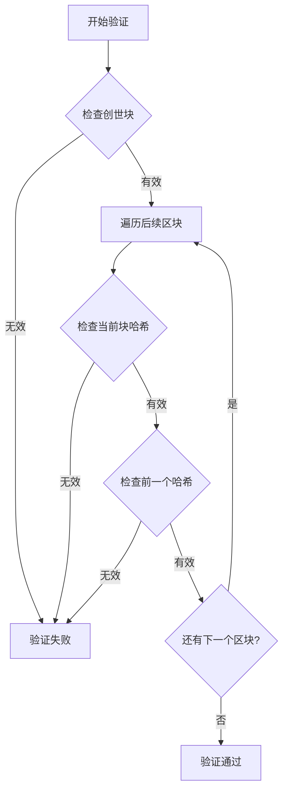

本页面详细介绍如何使用 qrcode_transfer 项目中的区块链完整性验证功能。该功能通过校验哈希链确保数据在传输过程中的一致性和安全性。

## 区块链完整性验证原理

qrcode_transfer 使用简化的区块链（哈希链）机制来记录关键操作。每个区块包含操作类型、任务ID、数据哈希以及前一个区块的哈希，形成一个不可篡改的链条。验证过程主要检查两个方面：
1. 每个区块自身的哈希是否正确（确保区块数据未被篡改）
2. 每个区块的前一个哈希是否指向正确的前一个区块（确保链条结构完整）



Sources: [blockchain.py](modules/blockchain.py#L153-L181)

## 使用验证功能

### 通过命令行验证

项目提供了命令行接口来验证区块链完整性。使用 `verify` 子命令即可触发验证：

```bash
python main.py verify
```

该命令会加载区块链文件（默认为 `hash_chain.json`），然后执行完整的验证流程，并将结果输出到日志中。

Sources: [main.py](main.py#L293-L333)

### 代码中直接验证

开发者也可以在代码中直接调用 `blockchain` 实例的 `is_chain_valid()` 方法：

```python
from modules.blockchain import blockchain

if blockchain.is_chain_valid():
    print("区块链完整性验证通过")
else:
    print("区块链完整性验证失败")
```

Sources: [blockchain.py](modules/blockchain.py#L153-L181)

## 验证逻辑详解

验证过程由 `Blockchain` 类的 `is_chain_valid()` 方法实现，步骤如下：

1. **验证创世块**：首先检查链中第一个区块（创世块）的哈希是否与重新计算的哈希一致。
2. **遍历验证后续区块**：从第二个区块开始，逐个验证：
   - 当前区块的哈希是否与重新计算的哈希一致
   - 当前区块的 `previous_hash` 是否等于前一个区块的 `hash`

如果所有检查都通过，则返回 `True`，否则返回 `False` 并记录详细的错误日志。

Sources: [blockchain.py](modules/blockchain.py#L153-L181)

## 哈希算法

项目支持多种哈希算法（可通过配置文件选择），包括：
- SHA256（默认）
- SHA512
- MD5

哈希算法的选择会影响区块链的安全性和性能。SHA256 是推荐的默认选项，在安全性和性能之间取得了良好的平衡。

Sources: [validator.py](modules/validator.py#L10-L43)

## 下一步

- 了解区块链的具体实现：[区块链实现](17-qu-kuai-lian-shi-xian)
- 配置区块链相关参数：[区块链配置](11-qu-kuai-lian-pei-zhi)
- 深入理解数据完整性验证：[数据完整性验证](18-shu-ju-wan-zheng-xing-yan-zheng)