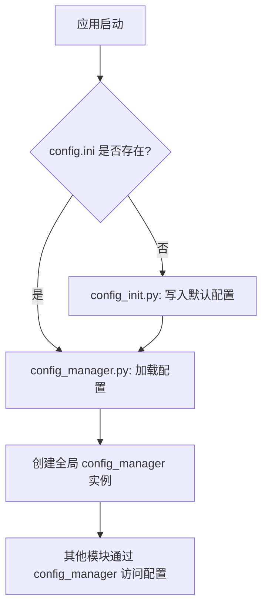

本页面提供 qrcode_transfer 项目配置文件的整体概览，帮助您理解配置系统的基本架构、主要配置段以及配置管理机制。

## 配置文件的核心作用

qrcode_transfer 使用标准 INI 格式的配置文件来管理所有运行时参数。该设计使得项目的配置与代码完全分离，用户无需修改代码即可调整系统行为。配置文件位于项目根目录下的 `config.ini`，或在打包后的可执行文件同目录下。

Sources: [config.ini](config.ini#L1-L55), [modules/config_init.py](modules/config_init.py#L7-L86)

## 配置系统架构

配置系统由两个核心模块组成：`config_init.py` 和 `config_manager.py`。下面是它们的交互关系图：



配置管理的关键特性：
- **自动初始化**：首次运行时会自动生成默认配置
- **环境适配**：自动适配开发环境与打包后的环境
- **全局访问**：提供单例模式的全局配置管理器

Sources: [modules/config_init.py](modules/config_init.py#L1-L86), [modules/config_manager.py](modules/config_manager.py#L1-L83)

## 主要配置段概览

项目的配置文件包含多个功能独立的配置段，下表列出了所有配置段及其用途：

| 配置段 | 主要用途 | 详细配置页面 |
|-------|---------|------------|
| `General` | 任务ID生成方式等通用设置 | - |
| `Compression` | 数据压缩相关配置 | [压缩配置](10-ya-suo-pei-zhi) |
| `QRCode` | 二维码生成参数配置 | [二维码配置](9-er-wei-ma-pei-zhi) |
| `Output` | 输出目录与临时文件目录配置 | - |
| `Log` | 日志系统配置 | [日志配置](12-ri-zhi-pei-zhi) |
| `Blockchain` | 哈希链完整性验证配置 | [区块链配置](11-qu-kuai-lian-pei-zhi) |
| `QRCodeReader` | 二维码读取器参数配置 | - |

Sources: [config.ini](config.ini#L1-L55)

## 配置管理机制

项目通过 `ConfigManager` 类实现对配置的统一管理，其主要功能包括：

- **配置加载**：从 INI 文件读取配置，禁用插值以支持日志格式中的占位符
- **类型安全访问**：提供 `getint()`, `getfloat()`, `getboolean()` 等类型转换方法
- **运行时修改**：支持在程序运行时修改配置并保存回文件
- **全局访问**：创建全局 `config_manager` 实例供所有模块使用

```python
# 典型的配置访问方式示例
from modules.config_manager import config_manager

# 获取配置项
version = config_manager.getint("QRCode", "Version")
enabled = config_manager.getboolean("Blockchain", "Enabled")
```

Sources: [modules/config_manager.py](modules/config_manager.py#L1-L83)

## 下一步

现在您已经了解了配置文件的整体架构，接下来可以深入了解各个配置段的详细配置：
- [二维码配置](9-er-wei-ma-pei-zhi)
- [压缩配置](10-ya-suo-pei-zhi)
- [区块链配置](11-qu-kuai-lian-pei-zhi)
- [日志配置](12-ri-zhi-pei-zhi)